# linux dotfiles

Debian dotfiles for **bash**, **tmux**, and **SSH** — Gruvbox dark theme
throughout. Adapted from the macOS set, with every macOS-only assumption
removed.

## What this is

A personal configuration for three machines I run, published so the ideas in it
can be borrowed — not a framework, and not something to install as-is. There is
nothing to configure and no options to set: every value here is the one a
specific machine needed. The hostnames are three real boxes, the subnets are the
ones they sit on, and the disk models in each guide are the disks in that
chassis.

So read it as a worked example rather than a product. Take the parts that are
portable — an alias, the prompt, the tmux status bar, a Notes block — and leave
the rest. The value is meant to be in the *why*: most blocks explain the
trade-off behind them, and the reasoning survives being moved to another machine
even where the values do not.

Read anything before you run it. Two defaults in particular are deliberate
choices for these hosts and are wrong for plenty of others:

- `ssh/config` sets `StrictHostKeyChecking no` and `UserKnownHostsFile
  /dev/null`, which disables host-key verification for every host. Reasonable on
  a bench of machines that are rebuilt constantly; not reasonable if a changed
  host key should mean something. See [Client](#client).
- `install.sh` replaces `.bashrc`, `.bash_profile`, `.bash_aliases`,
  `.tmux.conf` and `.hushlogin` outright, without prompting, on every run. See
  [What it overwrites](#what-it-overwrites-and-what-it-leaves-alone).

None of this has been tested anywhere but on these three machines. There is no
support and no promise that any of it keeps working.

## How to read this repository

The documentation comes in two kinds, and they do not overlap.

**This file is the master README.** It covers everything the three hosts share:
the network they form, the dotfiles themselves, and every behaviour that is
identical on all of them — the prompt, the aliases, the tmux bindings and status
bar, the GNOME shortcuts, and the SSH client and server settings. Read it first,
and read it once. The per-host guides deliberately do not repeat any of it.

**Each host then has its own build guide**, named for the machine and kept in
that machine's directory:

| Guide | Machine |
|---|---|
| [Silenus/Silenus.md](Silenus/Silenus.md) | Lenovo ThinkPad T14 Gen 4 (Intel), GNOME workstation — the machine these dotfiles were built on |
| [Dionysus/Dionysus.md](Dionysus/Dionysus.md) | Headless AMD Ryzen 9 3900X KVM and Docker host |
| [Hephaestus/Hephaestus.md](Hephaestus/Hephaestus.md) | Second headless KVM host, no GPU, on WiFi with a point-to-point cable to the laptop |

Each one is a complete build from bare metal for that single machine, and all
three follow the same outline: Part 1 for the OS install (BIOS, partitioning,
repositories and quota), Part 2 for the configuration. Every step carries
numbered sub-steps and a Notes block explaining why it is done that way. The
headless guides drop the steps that need a desktop and keep the rest in the same
order, so the three can be read side by side and diffed against one another.

Standing apart from both, [NVIDIA-GPU-Driver.md](NVIDIA-GPU-Driver.md) covers
the NVIDIA graphics driver, `nvidia-smi` and `nvtop` on any Debian 13 server
with a card — bare metal, or a VM with one passed through. SSH-only, no display,
no X server. It includes enrolling a Machine Owner Key, which a server with
Secure Boot needs and a VM usually does not. It names no host here and can be
used on its own.

Each host directory holds a complete, self-contained copy of what that machine
installs. The three duplicate one another rather than sharing a common
directory, which is the point: one directory can be copied to a new box and run
there with nothing else alongside it. Deploy by running the installer inside the
directory for that machine.

## The network

```mermaid
graph TB
    INET(("Internet"))
    R["Router &middot; home<br/>192.168.8.1<br/>no DHCP"]
    AP["WiFi &middot; work<br/>192.168.88.0/24"]
    INET --- R
    INET --- AP

    subgraph SIL ["Silenus &middot; ThinkPad T14 Gen 4"]
        SW["wlp0s20f3 &middot; WiFi<br/>connection: Huawei-Router<br/>192.168.8.2/24"]
        SP["enp0s31f6 &middot; onboard RJ45<br/>Dionysus 192.168.124.2/30<br/>Hephaestus 192.168.124.6/30"]
        SB["virbr1 &middot; static_network_24<br/>192.168.24.1/24 &middot; NAT"]
        SG["guests 192.168.24.2 &ndash; .254"]
        SB --- SG
    end

    subgraph DIO ["Dionysus &middot; Ryzen 9 3900X &middot; home"]
        DW["enp4s0 &middot; onboard Intel I211<br/>connection: wan<br/>192.168.8.3/24"]
        DP["p2plink0 &middot; external USB NIC<br/>192.168.124.1/30"]
        DB["virbr1 &middot; static_network_32<br/>192.168.32.1/24 &middot; NAT"]
        DG["guests 192.168.32.2 &ndash; .254"]
        DB --- DG
    end

    subgraph HEP ["Hephaestus &middot; work"]
        HW["wlp2s0 &middot; WiFi<br/>connection: wan<br/>192.168.88.212/24"]
        HE["eno1 &middot; onboard ethernet<br/>192.168.124.5/30"]
        HB["virbr1 &middot; static_network_40<br/>192.168.40.1/24 &middot; NAT"]
        HG["guests 192.168.40.2 &ndash; .254"]
        HB --- HG
    end

    R -.-|WiFi| SW
    R ---|ethernet| DW
    AP -.-|WiFi| HW
    SP ===|cable at home| DP
    SP -.-|cable at work| HE

    classDef wan fill:#1f6feb,stroke:#0b4fc0,color:#ffffff
    classDef p2p fill:#8957e5,stroke:#6a3fbf,color:#ffffff
    classDef guest fill:#2da44e,stroke:#1a7f37,color:#ffffff
    classDef infra fill:#57606a,stroke:#424a53,color:#ffffff
    class SW,DW,HW wan
    class SP,DP,HE p2p
    class SB,SG,DB,DG,HB,HG guest
    class R,AP,INET infra
```



Blue is each host's way out, purple the point-to-point links, green the guest
networks each host NATs behind itself. Dotted lines are wireless or a cable that
is only connected at one site; solid ones are permanent cable.

Silenus has one spare ethernet port and two peers, so it carries a profile for
each and only one is up at a time — `Dionysus` autoconnects at home,
`Hephaestus` is brought up by hand on arrival at work.

Three guest subnets, three point-to-point `/30`s out of one `/29`, and no two
overlap: the hosts can reach one another, so an address has to say which machine
it belongs to.

## Layout

```
.
├── README.md              this file, covering all three hosts
├── NVIDIA-GPU-Driver.md   GPU driver on a headless server, metal or VM
├── Silenus/               ThinkPad T14 Gen 4 (Intel) workstation
│   ├── bash/
│   │   ├── bash_profile   → ~/.bash_profile
│   │   ├── bashrc         → ~/.bashrc
│   │   └── bash_aliases   → ~/.bash_aliases
│   ├── tmux/
│   │   └── tmux.conf      → ~/.tmux.conf
│   ├── ssh/
│   │   └── config         → managed block in ~/.ssh/config
│   ├── hushlogin          → ~/.hushlogin
│   ├── kvm/
│   │   └── static_network_24.xml   the one libvirt network on this host
│   ├── install.sh         bash, tmux, ssh, and the GNOME parts
│   ├── check.sh
│   ├── gnome-app-folders.py
│   └── Silenus.md
├── Dionysus/              headless Ryzen 9 3900X KVM host
│   ├── bash/              same three files, without the DE/EN/kbd aliases
│   ├── tmux/
│   ├── ssh/
│   ├── hushlogin
│   ├── kvm/
│   │   └── static_network_32.xml   guest network, 192.168.32.0/24
│   ├── install.sh         bash, tmux, ssh only — no GNOME
│   ├── check.sh
│   └── Dionysus.md
└── Hephaestus/            second headless KVM host, no GPU
    ├── bash/  tmux/  ssh/  hushlogin
    ├── kvm/
    │   └── static_network_40.xml   guest network, 192.168.40.0/24
    ├── install.sh         identical to Dionysus/install.sh
    ├── check.sh
    └── Hephaestus.md
```

## Prerequisites

```bash
sudo apt install tmux vim git curl jq tree python3 openssl bash-completion xclip htop
```

## Deploy

```bash
cd Silenus     # or: cd Dionysus, cd Hephaestus
./install.sh
```

```bash
exec bash
```

The script is idempotent, and idempotent for both accounts. It asks once whether
to configure `root` as well — answer `y` to get the same prompt, aliases, and
tmux settings under `su`. The answer is recorded in `/etc/dotfiles-root-configured`,
so every later run refreshes `/root` too rather than leaving it on whatever an
earlier run happened to install. `--root` and `--no-root` answer the question for
an unattended run; deleting the stamp stops root being managed.

Run it as your own user, never as root. It installs into `$HOME`, so running it
as root configures `/root` and leaves your account untouched.

### What it overwrites, and what it leaves alone

`.bashrc`, `.bash_profile`, `.bash_aliases`, `.tmux.conf` and `.hushlogin` are
replaced outright on every run, for both accounts. They are this repository's
files; whatever is in them came from here, and anything added to them by hand is
lost on the next run. Put personal additions in a file this repository does not
name.

`~/.ssh/config` is the exception, because it holds Host entries that have nothing
to do with these dotfiles. Only the marked block is rewritten:

```
# >>> dotfiles managed block >>>
Host *
    StrictHostKeyChecking no
    ...
# <<< dotfiles managed block <<<
```

Everything outside the markers is kept byte for byte, and the block is written at
the **end** of the file. That position matters: `ssh` uses the first value it
finds for each keyword, so a `Host *` section sitting above the specific hosts
overrides all of them — `Port 22` in the defaults quietly defeats the `Port 443`
written for a host that has to reach the outside on 443. An install from before
the markers existed wrote the block at the top and had exactly that effect; the
first run of the current script moves it to the end and repairs those hosts.

## Differences from the macOS set

- No Homebrew, no `pbcopy`/`pbpaste`, no `gnubin` coreutils shim.
- `cpy` uses `xclip` when a display is present, and falls back to plain `tee` on
  a headless machine.
- `privip` lists every private address by interface. `ports` uses `ss -tunlp`.
- `b` prefers `btop` and falls back to `htop`.
- Plain colour prompt, not the macOS badge/powerline style, and segments are hidden rather than showing `disconnected` or `inactive`.
- No Option-key bindings. Ghostty on macOS sent `M-w/a/s/d` and `M-1`–`M-7`;
  on Linux those collide with terminal and window-manager shortcuts, so pane
  navigation is prefix-only.

## tmux

| Keys | Action |
|---|---|
| `Shift+←` / `Shift+→` | Previous / next window |
| `Ctrl+b` + `h/j/k/l` | Pane focus |
| `Ctrl+b` + arrows | Pane focus |
| `Ctrl+b` + `"` | Stacked pane, heights equalized |
| `Ctrl+b` + `x` | Close pane, heights equalized |
| `Ctrl+d` | Exit the shell, heights equalized |
| `Ctrl+b` + `Space` | Cycle layouts |
| `Ctrl+b` + `@` | Toggle synchronize-panes — borders turn red |
| `PgUp` / `PgDn` | Enter / scroll copy-mode |
| `q` / `Esc` | Exit copy-mode |
| `F12` | Toggle nested-tmux passthrough |

Windows and panes count from 1. tmux has no `session-base-index` option, so a
`session-created` hook renames unnamed sessions to `tmux01`, `tmux02`, and so
on. A session created with an explicit name keeps it.

Stacked panes stay equal height when one is closed, whether with `Ctrl+b x` or
`Ctrl+d`. The two paths fire different hooks — `after-kill-pane` and
`pane-exited` — so both are set.

`./gnome-app-folders.py` sorts the GNOME application grid into alphabetical
folders. `--list` previews, `--apply` does it, `--clear-dock` does it and also
empties the pinned dock, `--status` reads back what is set. With no arguments
it prints the options and changes nothing. It is idempotent, so re-run it after
installing anything.

`.bashrc` starts tmux for every interactive terminal. It attaches to the first
detached session if there is one, so closing a terminal window and opening a
new one puts you back where you were. With no detached session it starts a new
one. Opening several terminals therefore gives you `tmux01`, `tmux02`, and so
on rather than mirrored views of one session.

`window-size` is set to `smallest`, so the session fits the smallest attached
client and a larger one fills the leftover area with dots. The tmux default,
`latest`, resizes the session every time you use a different client, which makes
the pane sizes move around as you switch between the terminal and SSH.

Over SSH it asks first, the way `apt` does:

```
Start tmux session ssh1? [Y/n]
```

Enter takes the default and starts it; `n` leaves you at a plain shell. The
prompt exists because tmux repaints the whole screen as it starts, which wipes
the pre-authentication SSH banner before it can be read — taking the terminal
outright would make that banner pointless on exactly the logins it is meant
for. There is deliberately no timeout: a prompt that gave up on its own would
clear the banner while it was still being read. Answering anything other than
`n` starts tmux, so a stray keystroke does the expected thing. Local terminals
are not asked, because no banner is shown there.

Every SSH login gets a session of its own — `ssh1`, `ssh2`, and so on — for
whichever account is logging in, and a local shell never picks one of those
up. One session shared between two connections mirrors them: both clients see
the same windows, and tmux sizes them for the smaller, which crops one and
leaves an unpainted band in the other.

Reconnecting after a dropped link is the exception. If an `ssh` session is
sitting detached, the prompt offers that one instead — `Reattach to tmux
session ssh1? [Y/n]` — and the login attaches to it rather than opening another, so
the work survives the drop — which is the reason for running tmux over SSH at
all. Numbers are reused as sessions end, so they stay low rather than climbing
forever.

It skips when the shell is already inside tmux on this machine. `$TMUX` says so
directly; `sudo -i` and `su -` scrub it, so the check walks up the process tree
as well, which those commands cannot change.

`$TERM` is deliberately not used for this. `ssh` carries the client's `TERM`
across, so a login from a tmux window on another machine arrives reading
`tmux-256color` with no tmux running on the far end — and a test on `$TERM`
then skips exactly the sessions it exists to serve.

To open a terminal without tmux:

```bash
NO_AUTO_TMUX=1 bash
```

tmux is run rather than `exec`'d, so a broken `~/.tmux.conf` leaves you at a
working shell instead of a terminal that closes the moment it opens.

The status bar uses Gruvbox's background ramp only, no accents. It is chrome, so
it stays out of the way and lets the prompt carry the colour. Blocks are told
apart by stepping up that ramp rather than by hue.

| Element | Block | Text |
|---|---|---|
| inactive window | bg1 `#3c3836` | fg1 `#ebdbb2` |
| session name | bg2 `#504945` | bright yellow `#fabd2f` |
| active window | bg3 `#665c54` | fg0 `#fbf1c7` |
| zoomed marker | inherits bg3 `#665c54` | bright red `#fb4934` |

Both tabs stay light, so the active one is told apart by its lighter block
rather than by dimmer text. The session name carries bright yellow, since it
names the session and is worth picking out at a glance. bright red is the only accent left and appears only where
it means something — the zoomed marker and the synchronised-panes borders.

The zoomed marker sets no background of its own, so it inherits the active tab's
block and the tab stays one unbroken run of colour. That is a readability
trade-off taken on purpose: bright red on bg3 measures 1.89:1, against 4.77:1
back when the marker painted itself bg0_h. It survives on being bold, one
character wide, and the only red in the bar — but it is knowingly the weakest
pairing here, and the reason to accept it is that a near-black box dropped into
the middle of a tab broke the lightness ramp the whole bar is built on.

The bar itself uses `bg=default` so it takes the terminal's own background. A
terminal window whose height is not an exact multiple of the character cell
leaves a strip below the last row; any fixed background colour on the bar shows
up as a seam against it.

## Prompt

```
bahman @ Silenus ~/project main*⇡1 venv:api k8s:prod $
```

One line, plain colour, no badges and no background blocks. The accents are Gruvbox dark, used
exactly as published. The bright variants carry the prompt because the normal
ones sit too dark on `bg0`: blue is 3.48:1 normal against 5.48:1 bright, purple
the same. The colour lives here; the tmux bar stays neutral. No clock — use
`date` when you want one. Only the user name changes colour, so root is obvious at a glance
while the host name stays put.

| Segment | Colour | Shown when |
|---|---|---|
| user | bright green `#b8bb26`, bright red `#fb4934` for root | always |
| `@` | gray `#928374` | always |
| host | bright yellow `#fabd2f` | always |
| path | bright blue `#83a598` | always |
| branch | orange `#fe8019` | inside a git repository |
| `venv:` | bright purple `#d3869b` | a virtualenv is active |
| `k8s:` | bright aqua `#8ec07c` | `kubectl` has a current context |

Branch suffixes carry their own colour: `*` unstaged is Red, `+` staged is
Green, `⇡N` ahead and `⇣N` behind are Sky, `{N}` stashes is Flamingo.
The `$` turns red when the last command failed, and becomes `#` for root.

For the full effect set the terminal profile to Gruvbox dark too, so the
background is `#282828` and the ANSI colours match. The contrast figures above
are measured against that background.

`install.sh` uses the same palette for its own output: bright green for a step
that succeeded, bright yellow for a warning, gray for one that was skipped.

Needs a true-colour terminal. GNOME Terminal qualifies.

## Aliases

| Alias | Action |
|---|---|
| `update` | refresh apt sources, list what apt and flatpak would upgrade |
| `upgrade` | upgrade apt and flatpak, then autoremove, purge and drop unused runtimes |
| `c` / `reload` | clear / restart the shell |
| `t` | tmux |
| `v` | vim |
| `b` | btop, or htop if btop is missing |
| `ll` / `l` / `la` | listings |
| `DE` | keyboard: German only |
| `EN` | keyboard: US English and Persian |
| `kbd` | show the current input sources |
| `pubkey` | print the first SSH public key, and copy it to the clipboard |
| `password` | random base64-48 string |
| `pubip` / `privip` | external IP / every private address, by interface |
| `ports` | listening TCP and UDP sockets, with the process holding each |
| `cpy` | pipe filter — `cmd 2>&1 \| cpy` prints and copies |

`ports`, `update` and `upgrade` are functions, not aliases, because they decide
whether `sudo` is needed: as root they run the commands directly, otherwise through
`sudo`. `update` changes nothing beyond refreshing the package lists.

`privip` is a function for a different reason. On a machine running a VPN, Docker
and libvirt there is no single private address to report — this one holds five:

```
$ privip
wlp0s20f3   192.168.8.2  ← default route
tun0        10.11.12.21
tun1        192.168.80.53
virbr0      192.168.122.1
docker0     172.17.0.1
```

`hostname -I` prints those same five as one unlabelled line, in whatever order the
interfaces happened to appear, so it cannot tell you which is which. `privip`
names the interface behind each one and puts them in a useful order: the address
the kernel would actually route out with first, the local bridges last, since
docker0 and virbr0 are this host talking to its own containers and guests rather
than addresses anything else reaches it on. Marking the default route is a routing
table lookup: nothing is sent over the network.

`DE` and `EN` replace the GNOME input source list outright rather than adding
to it, so only the named layouts remain. They take effect immediately, with no
log out.

`install.sh` writes `~/.local/bin/lock-keyboard-en.sh` and runs it two ways.

`lock-keyboard-en.service` watches for the screen locking. On lock it makes
English the only layout, whatever was in use a moment earlier — German
included — so the password prompt is always typable. What was in use is written
to `$XDG_RUNTIME_DIR/lock-keyboard-en.previous` first, and the unlock restores
it. A deliberate German layout therefore survives a lock cycle rather than being
discarded by it, and the file lives under the runtime directory so a stale
layout is never restored across a reboot.

The English pair is the one thing not restored verbatim: it is put back by way
of English-only, so the session always comes back with English selected rather
than Persian. Rewriting the list is what resets the selection, so going through
English-only is what makes that certain instead of incidental. Every other
layout, German included, is restored exactly as it was.

`keyboard-en-tick.timer` runs every 10 minutes and manages the English pair
only. German, or any other list set by hand, is left untouched. With the pair in
use it drops Persian and restores it, which forces the selection back to
English: English stays English, Persian becomes English.

Those last two cases cannot be told apart. Both are the same `sources` list, and
the selected index is not readable — see below — so the drop and restore is what
produces the right result either way, rather than a branch on which of the two is
live. The only cost is two writes that leave the list exactly as it was when
English was already selected.

Only the layout list is written. GNOME ignores writes to the selected index,
and that key reads `0` even while Persian is the live layout, so removing the
unwanted layouts is the only method that reliably changes what is active.

Both are per-user: the settings, the services and the session bus all belong to
your login, so none of it applies to a root shell.

## GNOME shortcuts

`install.sh` sets these:

| Keys | Action |
|---|---|
| `Ctrl+Alt+T` | GNOME Terminal |
| `Super+E` | Files |
| `Super+I` | Settings |
| `Alt+Tab` | switch windows |
| `Shift+Alt+Tab` | switch windows, backwards |
| volume keys | move in 1% steps, not GNOME's default |

`Alt+Tab` normally switches *applications*, grouping every window of one
program behind a single icon. Moving it to `switch-windows` gives one entry per
window. The application switcher has to be cleared first, or it keeps the key.

`volume-step` lives in the same `media-keys` schema that is reset just before
these are written, so it has to be set after the reset or the reset undoes it.

Both schemas are reset to GNOME's defaults before these are applied, so the
result never depends on what was bound previously. Anything you bound by hand
is reset too.

## SSH

### Server

`install.sh` writes `/etc/ssh/sshd_config.d/99-local.conf` with
`PermitRootLogin prohibit-password`, so root can connect with a key but never
with a password. Ordinary users are unchanged and the port stays at 22.

It validates with `sshd -t` before reloading and restores the previous file if
sshd rejects it, because a bad `sshd_config` locks you out of the machine. It
also checks that `/etc/ssh/sshd_config` actually has the `Include` line for
`sshd_config.d`, since without it a drop-in is silently ignored.

### Client

`ssh/config` is appended to `~/.ssh/config`, replacing any stale block on
re-run. It sets `StrictHostKeyChecking no` and `UserKnownHostsFile /dev/null`
for every host, which disables host key verification. Remove those two lines if
you connect to machines where a changed host key should be an error.
