# Dionysus — AMD Ryzen 9 3900X, Debian 13 "trixie" headless KVM host

Hostname `Dionysus`. Purely headless: base system and `openssh-server` only, no
desktop environment, administered over SSH. The GNOME workstation is
[Silenus.md](../Silenus/Silenus.md).

ASUS ROG STRIX B450-F GAMING, AMD Ryzen 9 3900X (12c/24t), 125 GiB RAM, an
NVIDIA GeForce GTX 1080 reserved for guest passthrough, and two network
interfaces — an onboard Intel I211 and an external USB NIC, doing different
jobs. Three disks, sizes as `lsblk` reports them:

| Role | Device | Model | Size |
|---|---|---|---|
| OS and Docker `data-root` | `sda` | Samsung SSD 850 EVO 250GB | 232.9 GiB |
| `sssd` — VM system disks, Docker volumes | `nvme0n1` | Samsung SSD 970 EVO Plus 250GB | 232.9 GiB |
| `lssd` — VM data disks, Docker volumes | `nvme1n1` | Samsung SSD 970 EVO Plus 1TB | 931.5 GiB |

No swap partition and no swapfile anywhere in this build.

Every step here can be run again without harm. Files are written whole rather
than appended to, package installs skip what is present, and group membership
is unchanged when it is already granted. The single exception is `visudo` in
Step 3, which is a manual edit and is noted there.

**When something needs changing, change it here and re-run the step — never
patch the machine by hand.** A `sed` against a file this document writes leaves
the machine and the document disagreeing, and nothing will tell you which is
right. Every block is written to be run again: the `tee` calls overwrite, the
`nmcli` and `virsh` definitions replace, and the rule script deletes before it
inserts. Re-running a step is always cheaper than reconciling a drift later.

## Part 1 — OS installation

### Step 1 — BIOS: Secure Boot, virtualization, PCIe addressing

ASUS ROG STRIX B450-F GAMING, BIOS 5502.

| # | Step | How |
|---|------|-----|
| 1 | Enter BIOS | Power off fully, power on, tap **Del** at the ASUS splash |
| 2 | Leave EZ Mode | **F7** switches to Advanced Mode, where everything below lives |
| 3 | Note BIOS version | `Main` tab — 5502 at the time of writing |
| 4 | Secure Boot | `Boot → Secure Boot → OS Type` = **Windows UEFI mode** |
| 5 | Enable SVM | `Advanced → CPU Configuration → SVM Mode` = **Enabled** |
| 6 | Enable IOMMU | `Advanced → AMD CBS → NBIO Common Options → IOMMU` = **Enabled** |
| 7 | Above 4G Decoding | `Advanced → PCI Subsystem Settings → Above 4G Decoding` = **Enabled** |
| 8 | Resizable BAR | Same menu, `Re-Size BAR Support` = **Auto** |
| 9 | Save and exit | **F10** → **Yes** |
| 10 | Boot the installer | **F8** at the splash, pick the USB device |

**Notes**

- The menu paths are ASUS's AM4 convention. BIOS 5502 matches them at the time of writing, but confirm each on screen rather than trusting the path: a BIOS update can move a setting between `Advanced` and `AMD CBS` without renaming it.
- Secure Boot is already enabled on this machine and Debian 13 already boots on it, so this is a check rather than a change. `mokutil --sb-state` reports `SecureBoot enabled` today.
- On ASUS boards the switch is `OS Type`, not a named 3rd party CA toggle. **Windows UEFI mode** enforces Secure Boot against the shipped key set, which includes Microsoft's 3rd party UEFI CA — the one that signs Debian's bootloader. `Other OS` disables the enforcement rather than adding a key.
- Debian's bootloader is signed by Microsoft's 3rd party UEFI CA. Without that key present the machine will not boot and shows `Invalid signature detected`.
- The GTX 1080 is Pascal and does not implement Resizable BAR, so `Auto` changes nothing for it. `Above 4G Decoding` is the one of the pair that matters here: it is what lets the card's BARs be mapped above the 4 GB boundary, which passthrough needs.
- Turning the 3rd party CA on may switch `Secure Boot Mode` from `Standard` to `Custom`. That is expected. Custom only means the key set is no longer the factory default; Secure Boot still checks every signature.
- Never use `Reset to Setup Mode` or `Clear All Secure Boot Keys`. They cause the failure above and Debian does not need them.
- Secure Boot does not conflict with GPU passthrough. `vfio-pci` ships inside Debian's signed kernel, so binding the card in Step 9 is unaffected. What Secure Boot blocks is loading an *unsigned out-of-tree* module — the proprietary NVIDIA driver on the host being the usual one, which this build blacklists anyway.
- `SVM` is AMD's name for the virtualization extensions. Without it KVM cannot start a guest at all, and `/proc/cpuinfo` shows no `svm` flag.
- `IOMMU`, `Above 4G Decoding` and `Resizable BAR` are what make the VFIO groups in Step 9 usable. All three must be set before the OS can see the groups, which is why they are here rather than alongside the passthrough work.
- There is no swap anywhere in this build, so the hibernation caveat that applies to Silenus does not arise here.

### Step 2 — Disk partitioning

Choose **Manual** partitioning. `partman` supports XFS natively, so the layout
is created at install time rather than rebuilt afterwards. The installer counts
in decimal, so `MB` means 1,000,000 bytes. Type the **Enter as** value. The
installer will then display the **Shows as** value.

**SATA SSD (`sda`)**

| # | Partition | Size | Enter as | Shows as | Format | Mount |
|---|-----------|------|----------|----------|--------|-------|
| 1 | EFI | 1 GiB | `1075 MB` | 1.1 GB | EFI System Partition | `/boot/efi` |
| 2 | Boot | 2 GiB | `2147 MB` | 2.1 GB | ext4 | `/boot` |
| 3 | Root | 32 GiB | `34360 MB` | 34.4 GB | ext4 | `/` |
| 4 | Data | 192 GiB | `206158 MB` | 206.2 GB | xfs | `/data-root` |

**NVMe 250 GB (`nvme0n1`) — 232.9 GiB**

| # | Partition | Size | Enter as | Shows as | Format | Mount |
|---|-----------|------|----------|----------|--------|-------|
| 1 | sssd | 192 GiB | `206158 MB` | 206.2 GB | xfs | `/data-root/sssd` |

**NVMe 1 TB (`nvme1n1`) — 931.5 GiB**

| # | Partition | Size | Enter as | Shows as | Format | Mount |
|---|-----------|------|----------|----------|--------|-------|
| 1 | lssd | 888 GiB | `953483 MB` | 953.5 GB | xfs | `/data-root/lssd` |

**Hostname and network, during the install**

The router runs no DHCP, so the installer's automatic configuration will fail
and drop to asking. That is expected — answer it:

| Field | Value |
|---|---|
| Interface | the onboard Intel I211, `enp4s0` |
| IP address | `192.168.8.3` |
| Netmask | `255.255.255.0` |
| Gateway | `192.168.8.1` |
| Name server | `8.8.8.8` |
| Hostname | `dionysus` |
| Domain | leave empty |

Package selection: base system and `openssh-server` only. Deselect the desktop
environment task; this host stays headless.

**Notes**

- The hostname is what makes this machine Dionysus rather than Nyx. The installer writes it to `/etc/hostname` and `/etc/hosts`; nothing later in this document sets it.
- Without a working network the installer cannot reach the mirror, and Steps 3 to 8 have nothing to install from. `Network autoconfiguration failed` is the expected message on this LAN, not a fault.
- Configure only the onboard interface here. The external USB NIC has no carrier unless the cable to Silenus is plugged in, and Step 10 configures it properly; if the installer offers a choice, pick `enp4s0`.
- The installer counts in GB, `df -h` counts in GiB. The root partition is entered as `34360 MB`, shows as `34.4 GB`, and reports as `32G` once installed. Same partition.
- For any other size: type `GiB x 1073.741824` MB, rounded. The EFI partition is entered as `1075 MB` rather than the 1074 the formula gives; that is the number Silenus uses for the same partition, and one megabyte over makes no difference.
- The four partitions on `sda` come to 227 GiB of the 233 GiB the disk reports, leaving about 6 GiB unpartitioned. That free space is SSD over-provisioning, the same reasoning as Silenus: the drive uses it for wear levelling, which keeps write speed up as the disk fills. It is a smaller margin than Silenus keeps — 2.6% against 6.6% — so raise it by taking a few GiB off `/data-root` if this disk is expected to run close to full.
- `data-root` is a fixed 192 GiB rather than `max` precisely so that margin exists. `max` would consume the whole remainder and leave none.
- Neither NVMe disk uses `max` either. `nvme0n1` takes 192 GiB of 232.9, leaving 40.9 GiB — 17.6%, a generous margin. `nvme1n1` takes 888 GiB of 931.5, leaving 43.5 GiB — 4.7%. Both are deliberate: these disks hold VM images and Docker volumes, which are write-heavy in a way that makes over-provisioning worth more than the capacity it costs.
- 960 GiB does not fit on `nvme1n1`. The drive is sold as 1 TB, which is 10^12 bytes and therefore 931.5 GiB, so 960 GiB overruns it by 28.5. 888 GiB is the size Silenus uses for its own root partition, and enters as the same `953483 MB`.
- Sizes on the installed system: `lsblk` reports `1023M`, `2G`, `32G` and `192G` on `sda`, `192G` on `nvme0n1p1` and `888G` on `nvme1n1p1`. The EFI partition reads as `1023M` rather than `1G` because the entered `1075 MB` is decimal; `df -h` reports it smaller still, about `1022M`, because the FAT filesystem uses a little of it. All correct.
- `sda4` mounts at `/data-root` first and the two NVMe partitions mount as nested points beneath it. The installer creates the parent directory and orders the mounts itself, so no separate top-level mountpoints are needed.
- OS install ISOs live on the SATA SSD under `/data-root/isos`, referenced by the functional tests in Step 12.
- No swap partition. Omit it from the table entirely rather than adding one and disabling it later.
- The installer warns that no swap space is selected. Continue.
- XFS project quota (`pquota`/`prjquota`) is the one thing `partman`'s mount-options list does not expose. It is added to `/etc/fstab` after first boot, in Step 3. Formatting and mounting are handled by the installer.

### Step 3 — After install: repositories, quota, checks

#### 1. Become root

Everything in this step is run as root.

```bash
su -
```

#### 2. Install vim and sudo

```bash
apt update
```

```bash
apt install -y vim sudo
```

`visudo`, used in the next sub-step, comes from the `sudo` package rather than
from vim. The installer only installs `sudo` when the root password is left
empty; setting one leaves the package out altogether, and `visudo` reports
`command not found`.

Make vim the default editor for `visudo` and friends:

```bash
update-alternatives --config editor
```

#### 3. Add your user to sudoers

The installer only grants `sudo` when the root password is left empty. If you
set a root password, the user has none — and, as the previous sub-step notes,
the package is not installed either.

```bash
visudo
```

Find this line:

```
root    ALL=(ALL:ALL) ALL
```

Add your own user underneath it, replacing `username` with your login name:

```
username    ALL=(ALL:ALL) ALL
```

Save and exit. `visudo` checks the syntax before writing and refuses to save a
broken file, which is why it is used instead of editing the file directly.

This is the one step that is not safe to repeat blindly: running it again adds
a second identical line. `sudo` tolerates the duplicate, but check whether your
user is already there before adding it.

Check it:

```bash
sudo -l -U username
```

#### 4. Add contrib and non-free

The installer writes the classic file, not a `.sources` file:

```bash
vim /etc/apt/sources.list
```

Make the file read exactly this:

```
deb http://deb.debian.org/debian/ trixie main contrib non-free non-free-firmware
deb-src http://deb.debian.org/debian/ trixie main contrib non-free non-free-firmware

deb http://security.debian.org/debian-security trixie-security main contrib non-free non-free-firmware
deb-src http://security.debian.org/debian-security trixie-security main contrib non-free non-free-firmware

deb http://deb.debian.org/debian/ trixie-updates main contrib non-free non-free-firmware
deb-src http://deb.debian.org/debian/ trixie-updates main contrib non-free non-free-firmware
```

Only `contrib` and `non-free` are new. Keep the suite name — `trixie`,
`trixie-security`, `trixie-updates` — between the URL and the components. If
you drop it, `apt update` fails with a 404 on the Release file.

Check the result:

```bash
grep ^deb /etc/apt/sources.list
```

#### 5. Update the system

```bash
apt full-upgrade
```

#### 6. Install the tools used for checking

```bash
apt install -y mokutil dmidecode efibootmgr
```

#### 7. Confirm ftype on all three XFS filesystems

A hard requirement for both `overlay2` and project quotas. `partman`'s defaults
are not guaranteed to match a manual `mkfs.xfs`, so check rather than assume:

```bash
xfs_info /data-root      | grep ftype
```

```bash
xfs_info /data-root/sssd | grep ftype
```

```bash
xfs_info /data-root/lssd | grep ftype
```

Expect `ftype=1` on all three.

`xfs_info: cannot open /data-root/...: Is a directory` does not mean the path is
missing. It means that path is not an XFS mount, so `xfs_info` fell through to
treating the argument as a device file. The usual cause is the wrong filesystem
type being picked for that partition in the installer — the next sub-step names
it outright.

#### 8. Confirm what the installer mounted

```bash
findmnt -no SOURCE,TARGET,FSTYPE,OPTIONS /data-root /data-root/sssd /data-root/lssd
```

All three must read `xfs`. Anything else has to be reformatted before going on:
the project quota this build rests on is an XFS feature, and Docker's
`--storage-opt size=` rests on the quota.

#### 9. Add project quota to fstab

```bash
vim /etc/fstab
```

Append `,pquota` immediately after `defaults` in the options field of those
three XFS entries. Leave every other line alone.

#### 10. Edit GRUB: IOMMU and the boot console

GPU passthrough needs the IOMMU on the kernel command line. This is the only
place GRUB is edited: Step 9 stages the rest of the passthrough work but does
not touch this file again.

```bash
vim /etc/default/grub
```

These five lines are the whole active configuration. Make the uncommented lines
in the file read exactly this, and leave every commented line below them alone:

```
GRUB_DEFAULT=0
GRUB_TIMEOUT=9
GRUB_DISTRIBUTOR=`( . /etc/os-release && echo ${NAME} )`
GRUB_CMDLINE_LINUX_DEFAULT="quiet loglevel=3 systemd.show_status=auto udev.log_level=3 amd_iommu=on iommu=pt vfio-pci.disable_idle_d3=1"
GRUB_CMDLINE_LINUX=""
```

The whole set is written out rather than a list of lines to change, so a missing
line is obvious. `GRUB_DEFAULT` and `GRUB_DISTRIBUTOR` come from the installer
and are left as they are.

Apply it:

```bash
update-grub
```

#### 11. Reboot

```bash
systemctl reboot
```

This reboot is what makes the quota live. XFS initializes project quota on an
actual mount and refuses to do it on a remount, and every filesystem is mounted
fresh here — so no unmount and remount sequence is needed. The machine has to
come back for GRUB regardless.

Log back in and become root again before the checks:

```bash
sudo -i
```

#### 12. Check Secure Boot

```bash
mokutil --sb-state
```

Expect `SecureBoot enabled`.

```bash
dmesg | grep -i "secure boot"
```

Expect `secureboot: Secure boot enabled`.

#### 13. Check the machine booted through shim

```bash
efibootmgr -v | grep -i shim
```

Expect `\EFI\debian\shimx64.efi`.

#### 14. Check the disk

```bash
lsblk -o NAME,SIZE,TYPE,FSTYPE,MOUNTPOINTS
```

Expect `1G`, `2G`, `32G` and `192G` on `sda`, with `sda4` and both NVMe disks XFS.

```bash
swapon --show
```

Expect no output.

#### 15. Check the quota is active

```bash
findmnt -no OPTIONS /data-root | tr ',' '\n' | grep quota
```

Expect `prjquota`.

```bash
xfs_quota -x -c 'state' /data-root
```

```bash
xfs_quota -x -c 'state' /data-root/sssd
```

```bash
xfs_quota -x -c 'state' /data-root/lssd
```

Expect `Accounting: ON` and `Enforcement: ON` on all three.

#### 16. Check the IOMMU came up

```bash
grep -o 'amd_iommu=on' /proc/cmdline
```

```bash
dmesg | grep -i 'AMD-Vi'
```

Expect the flag on the live command line and AMD-Vi lines in the log. The rest
of the passthrough chain is checked in Step 12, after Step 9 has staged it.

#### 17. Check the BIOS version

```bash
dmidecode -s bios-version
```

Compare with what you wrote down in Step 1.

**Notes**

- If the Secure Boot check says `SecureBoot disabled`, the `Secure Boot` toggle is Off in the BIOS. Turn it back on and redo Step 1.
- A BIOS update can reset BIOS settings, `SVM` and `IOMMU` included. Re-read this whole block after one, not only the Secure Boot line.
- A partition created as the wrong type is worth catching here rather than by its symptoms later. `lost+found` in the root of a mount is a good tell: ext4 creates it, XFS never does. So is a gap between `Size` and `Avail` in `df` on an almost-empty filesystem — ext4 reserves 5% of its blocks for root, XFS reserves none.
- Reformatting one of these is cheap while they are empty: `umount`, `mkfs.xfs -f <device>`, then fix `/etc/fstab`. `mkfs.xfs` writes a **new UUID**, so the `UUID=` in fstab has to be replaced with `blkid -s UUID -o value <device>` — left stale, the next boot waits for a device that no longer exists. Set the type to `xfs` and the fsck pass to `0` in the same edit: XFS has no boot-time fsck, and a pass of `2` makes it fail on every boot.
- Use `state`, not `report -p`. With no projects assigned yet, `report -p` prints nothing whether quota is on or off, which hides exactly the failure this check exists to catch.
- The quota goes in `/etc/fstab` here, not on the kernel command line. That is the opposite of Silenus, where the quota is on `/` — root is mounted before `/etc/fstab` is read, so it has to go in `GRUB_CMDLINE_LINUX` there. On this host the quota is on `/data-root`, an ordinary fstab mount, so fstab is the right place.
- The kernel renames the options: `pquota` shows as `prjquota` in `findmnt`.
- If a `umount` reports the target is busy, something is holding it open. `fuser -m /data-root` names the process.

The installation is done.

## Part 2 — Configuration

### Step 4 — Firmware updates

Everything on this machine that publishes firmware to LVFS can be updated from
Linux. The motherboard is the exception and is handled separately, in the notes.

#### 1. Become root

```bash
sudo -i
```

#### 2. Install fwupd

```bash
apt install -y fwupd fwupd-amd64-signed
```

#### 3. Refresh the firmware list

```bash
fwupdmgr refresh --force
```

#### 4. See what the machine has

```bash
fwupdmgr get-devices
```

#### 5. See what is available

```bash
fwupdmgr get-updates
```

#### 6. Apply

```bash
fwupdmgr update
```

#### 7. Reboot to apply

```bash
systemctl reboot
```

Log back in and become root again before continuing:

```bash
sudo -i
```

#### 8. Check nothing is left

```bash
fwupdmgr get-updates
```

The last line must read `No updates available`. If it does not, repeat from the
Apply sub-step.

#### 9. Check Secure Boot survived

```bash
mokutil --sb-state
```

Expect `SecureBoot enabled`.

**Notes**

- `fwupd-amd64-signed` holds the Debian-signed EFI file. Without it firmware updates stop working once Secure Boot is on, which it is on this host.
- Never power off during a firmware update.
- Firmware is written during the reboot, not by `fwupdmgr update`. Apply, reboot and re-check are one round. Repeat until the check is clean.
- `Devices with no available firmware updates` and `Devices with the latest available firmware version` both mean nothing to do. Only the last line decides.
- **This is a desktop board, not a Lenovo laptop, and that changes what to expect.** Lenovo publishes to LVFS, which is why Silenus updates its BIOS this way. ASUS does not generally publish consumer motherboard firmware there, so do not be surprised if the B450-F itself never appears in `get-devices`. Its BIOS is updated from the firmware's own **EZ Flash** utility, with the `.CAP` file on a FAT32 USB stick — the same route that got this board to 5502. Verify against ASUS's own support page rather than assuming either way.
- The NVMe disks may or may not appear. Samsung consumer drives are largely absent from LVFS; `fwupdmgr get-devices` is the honest answer for this machine, not a list written in advance.
- The AC-power caveat that applies to Silenus does not apply here. This machine has no battery, so nothing is skipped for want of mains power.
- A BIOS update resets BIOS settings on many boards, `SVM` and `IOMMU` included. After one, redo Step 1 and re-run the checks in Step 3.

### Step 5 — Packages

#### 1. Become root

The rest of this step is run as root.

```bash
sudo -i
```

#### 2. Install the packages

```bash
apt install -y bash-completion bridge-utils btop curl git iptables iputils-ping jq lshw make network-manager openssl pciutils progress pwgen python3 rsync sshuttle sudo tmux tree unrar vim wget
```

#### 3. Check the CPU exposes virtualization

```bash
grep -Ec '(vmx|svm)' /proc/cpuinfo
```

Expect a number above 0. This machine is AMD, so the flag is `svm`.

**Notes**

- This is Silenus's package list with everything desktop-only removed: no GNOME, no flatpak, no fonts, no media applications, none of which has anything to talk to on a headless host.
- Claude Code is not installed here either, though Silenus has it. It is a developer tool for the machine you work at; a server has no use for it, and its repository and signing key are two more things to keep trusted for no return. Reach this host over SSH from Silenus instead.
- `bash-completion`, `python3` and `openssl` are here because `install.sh` in Step 6 checks for them and warns if they are missing.
- `network-manager` is here because a headless Debian install does not have it. It arrives on a desktop machine as a dependency of `gnome-core`, which is why Silenus has it without ever asking; no task a base install selects pulls it in. Step 10 needs `nmcli`, so it is installed with everything else rather than in the middle of reconfiguring the network.
- Installing it here changes nothing on its own. Debian ships NetworkManager with `[ifupdown] managed=false`, so it will not touch `enp4s0` while the installer's stanza is still in `/etc/network/interfaces`. Handing that interface over is a deliberate act in Step 10. `tmux`, `vim`, `git`, `curl`, `jq` and `tree` are on the same list and already above.
- `openssh-server` was installed by the Debian installer in Step 2 and is what you are connected over. It is not repeated here.
- `net-tools` provides `netstat`, `ifconfig` and `route`. They are superseded by `ss` and `ip` from `iproute2`, which is already installed. Add it if the old names are what your muscle memory reaches for.
- `pciutils` supplies `lspci`, which the whole of Step 9 depends on to find the GPU and confirm what driver holds it. Its Debian priority is `standard`, so a default install has it — but this build deselects tasks, and a package Step 9 cannot work without is not worth leaving to chance.
- `iptables` is here to make libvirt's choice deterministic. `/etc/libvirt/network.conf` documents the default as the first available of `[iptables, nftables]`, and `libvirt-daemon-system` depends on neither, so the backend would otherwise be decided by whatever else happened to pull one in. Steps 11 and 12 read libvirt's `LIBVIRT_PRT` and `LIBVIRT_FWO` chains with `iptables`; under the nftables backend those chains do not exist and the commands would show nothing while everything was in fact working.
- `iputils-ping` is priority `important` and present on every Debian install, so this is belt and braces. It costs nothing and the verification steps lean on `ping` throughout.
- `bridge-utils` supplies `brctl`, used by the verification in Step 10. `ip link` shows the same information; `brctl show` is kept because it prints the bridge-to-member mapping more compactly.

### Step 6 — Bash, tmux, and SSH configuration

The bash, tmux, and SSH configuration is in this repository, in this host's own
directory. Everything it needs was installed in Step 5.

#### 1. Leave the root shell

Step 5 ended as root. Everything in this step runs as your own user, the clone
included — a repository cloned by root lands in `/root`, which is mode `0700`,
so your account could not even read it afterwards.

```bash
exit
```

#### 2. Get the repository onto this machine

A freshly installed host does not have it yet:

```bash
git clone <repository-url> ~/dotfiles
```

```bash
cd ~/dotfiles/linux_terminal_dotfiles_configuration/Dionysus
```

Keep it. `install.sh` needs the directory to re-run, and Step 7 reads
`kvm/static_network_32.xml` from it — by way of your home directory, which is
why it has to be cloned there.

#### 3. Run the installer

```bash
./install.sh
```

#### 4. Reload the shell

```bash
exec bash
```

**Notes**

- Run it from `Dionysus/` in this repository, as your own user. As root it configures `/root` and leaves your account untouched.
- It asks once whether to configure `root` as well. Answer `y` for the same prompt, aliases, and tmux settings under `su`. The answer is recorded in `/etc/dotfiles-root-configured`, so every later run keeps `/root` in step rather than leaving it on whatever an earlier run installed.
- Safe to re-run. The SSH block is replaced between its markers, not duplicated, and your own `Host` entries outside the markers are untouched.
- Keep the repository. The installer needs it to re-run.
- This is `Dionysus/install.sh`, not Silenus's. It carries no keyboard-lock service, no GNOME shortcuts and no GTK3 dark setting, because none of them has a session to act on here. The bash, tmux and SSH halves are identical to Silenus.
- `Dionysus/bash/bash_aliases` also drops the `DE`, `EN` and `kbd` aliases. They call `gsettings` against the GNOME input-source schema, which does not exist on this host.
- `.bashrc` adds `/usr/local/sbin`, `/usr/sbin` and `/sbin` to your PATH. Debian leaves these out for non-root users, so `sysctl`, `swapon` and `iptables` report `command not found` even though `sudo` runs them.
- Check it with `command -v sysctl`. It must print `/usr/sbin/sysctl`. If it prints nothing, the shell has not been reloaded yet.
- It writes `/etc/ssh/sshd_config.d/99-local.conf` so root can only reach SSH with a key, never a password. Ordinary users and port 22 are unchanged. This needs sudo, so answer `y` at the root prompt. On a host reached only over SSH, confirm you can still open a second session before closing the first.
- A command typed with a leading space is not written to the history file. Use it for anything carrying a password or a token. One space is enough.
- History is written at every prompt, not only when the shell exits. A tmux pane that is killed rather than closed keeps everything typed in it.
- Every SSH login is offered a tmux session of its own, `ssh1`, `ssh2` and so on, for whichever account is connecting. It asks the way `apt` does — `Start tmux session ssh1? [Y/n]`, Enter for yes, `n` for a plain shell — because tmux repaints the screen as it starts and would wipe the pre-authentication banner before it could be read. There is no timeout on the prompt, so the banner stays up until you answer. Two windows onto this host do not mirror each other. Reconnecting after a dropped link attaches to the session left behind rather than opening another, so work survives the drop — which matters on a host reached only over the network.
- It also writes `/etc/profile.d/99-history.sh` so both rules apply to every account, not only yours.
- It also writes `/etc/ssh/banner.txt` and points sshd at it with `Banner`, so it is shown **before authentication** and to **every account**. That is the right place for a notice telling someone they are not welcome — after login it is addressed to a person who is already in — and it is the only place that works here, because `~/.hushlogin` suppresses the motd for any account that has one. The file carries a name and a short notice and no hostname or kernel version, so it is correct unchanged on every host.
- `/etc/motd` is emptied and `/etc/update-motd.d/10-uname` has its execute bit dropped, which removes Debian's licence paragraphs and the kernel line for any account without a `.hushlogin` — root, in practice. The file is not deleted, so a package upgrade can restore it and the next `install.sh` run turns it off again. `Last login` is left alone: it is worth seeing.
- `cpy` falls back to plain `tee` when there is no display, so it prints and copies nothing here rather than failing.
- `README.md` at the top of the repository covers the prompt, the tmux keys, and what changes.

### Step 7 — KVM and libvirt

#### 1. Become root

The rest of this step is run as root.

```bash
sudo -i
```

#### 2. Install the packages

```bash
apt install -y qemu-system-x86 qemu-utils ovmf virtinst libosinfo-bin osinfo-db osinfo-db-tools libvirt-daemon-system libvirt-clients libguestfs-tools
```

#### 3. Start the daemon

```bash
systemctl enable --now libvirtd.socket
```

```bash
systemctl is-active libvirtd.socket
```

Expect `active`. `libvirtd.service` itself stays `inactive` until something
connects to the socket, which is normal and not a fault.

#### 4. Turn on nested virtualization

Required only for running a hypervisor — ESXi, OpenStack — inside a guest.
Ordinary guests do not use it. This is an AMD platform, so the module is
`kvm_amd`, not `kvm_intel`.

```bash
cat /sys/module/kvm_amd/parameters/nested
```

If it prints `Y` or `1`, skip the rest of this sub-step. Otherwise:

```bash
echo 'options kvm_amd nested=1' > /etc/modprobe.d/kvm-amd.conf
```

```bash
modprobe -r kvm_amd
```

```bash
modprobe kvm_amd
```

```bash
cat /sys/module/kvm_amd/parameters/nested
```

Expect `1`. `kvm_amd` exposes this parameter as an integer where `kvm_intel`
exposes a boolean, so Silenus reports `Y` for the same setting and this host
reports `1`. Both mean on.

#### 5. Raise the open file limit

```bash
vim /etc/security/limits.d/99-kvm.conf
```

Put this in it:

```
*    soft    nofile    65536
*    hard    nofile    1048576
```

#### 6. Define the storage pools

On the two NVMe disks from Step 2:

```bash
virsh pool-define-as sssd-pool dir --target /data-root/sssd
```

```bash
virsh pool-build sssd-pool
```

```bash
virsh pool-start sssd-pool
```

```bash
virsh pool-autostart sssd-pool
```

```bash
virsh pool-define-as lssd-pool dir --target /data-root/lssd
```

```bash
virsh pool-build lssd-pool
```

```bash
virsh pool-start lssd-pool
```

```bash
virsh pool-autostart lssd-pool
```

```bash
virsh pool-list --all
```

Expect `sssd-pool` and `lssd-pool` both active, with autostart `yes`.

#### 7. Remove the default NAT network

`libvirtd` creates a `default` NAT network on install, typically
`192.168.122.0/24`, with its own DHCP server. This host uses one network only,
so it is removed rather than left stopped:

```bash
virsh net-destroy default
```

```bash
virsh net-undefine default
```

There is also a `default` **storage** pool, pointing at
`/var/lib/libvirt/images`. It is left alone — `virt-manager` recreates it the
next time it connects, so removing it only means removing it again. What
matters is knowing where it points, which the notes cover.

```bash
virsh pool-list --all
```

Expect `sssd-pool` and `lssd-pool`, alongside whatever `default` libvirt keeps.

#### 8. Define the one network this host uses

`static_network_32` — NAT on `192.168.32.0/24`, no DHCP, guests configured
statically. The definition is `kvm/static_network_32.xml` in this repository,
and its comment block carries the address plan.

`sudo -i` in sub-step 1 left you in `/root`, so go back to the host directory
first — this path is relative to it:

```bash
cd ~<your-user>/dotfiles/linux_terminal_dotfiles_configuration/Dionysus
```

```bash
virsh net-define kvm/static_network_32.xml
```

```bash
virsh net-start static_network_32
```

```bash
virsh net-autostart static_network_32
```

```bash
virsh net-list --all
```

Expect `static_network_32` active with `Autostart yes`, and no `default`.

```bash
ip -br addr show virbr1
```

Expect `192.168.32.1/24`. libvirt creates and owns this bridge, which is why
Step 10 builds no bridge of its own.

#### 9. Leave the root shell

```bash
exit
```

#### 10. Add your user to the libvirt and kvm groups

```bash
sudo usermod -aG libvirt,kvm $USER
```

Log out and log back in, then check:

```bash
groups
```

Expect `libvirt` and `kvm` in the list.

**Notes**

- There is no `qemu-kvm` package in trixie. `qemu-system-x86` is the one that provides the emulator, and KVM itself is a kernel module that is already present. An install line naming `qemu-kvm` fails outright with no candidate.
- `virt-manager` is not installed. It is a GTK3 desktop application with nothing to display on here. Manage this host from Silenus over SSH with `virt-manager -c qemu+ssh://dionysus/system`, or from the command line with `virsh`.
- The `usermod` sub-step has to run as your own user, not root. Under `sudo` as root, `$USER` is `root`, so the groups would be added to the wrong account.
- The connection URI matters. Run as an ordinary user, `virsh` defaults to `qemu:///session`, a per-user hypervisor with no networks and no machines. The system VMs are on `qemu:///system`. Set `LIBVIRT_DEFAULT_URI=qemu:///system` if you would rather not type it each time.
- Group membership only applies at the next login. `newgrp libvirt` works for one shell if you do not want to log out.
- `modprobe -r kvm_amd` fails if a virtual machine is running. Shut them down first.
- `xfs_info` on `/data-root` needs `sudo` once Docker owns that path. Docker sets its `data-root` to mode `0710`, so an ordinary user cannot open the directory and the command fails with nothing useful to say. The same applies to the two mounts nested beneath it.
- `dmesg` needs `sudo` as well. Debian sets `kernel.dmesg_restrict=1`, so the kernel log is root-only, and a check that reads it as an ordinary user finds an empty buffer rather than an error.
- The packaged `osinfo-db` is the maintained source, refreshed by `apt upgrade`. Do not use `osinfo-db-import --latest`: it fetches from `releases.pagure.org`, a third-party host libosinfo's own maintainers have flagged as unreliable. It is what makes `virt-install --os-variant` resolve rather than guess.
- `/etc/security/limits.d` applies to login sessions, not to systemd services. If `libvirtd` itself needs a higher limit, add a `LimitNOFILE` drop-in under `/etc/systemd/system/libvirtd.service.d/`.
- **Always name a pool when creating a guest.** The `default` storage pool points at `/var/lib/libvirt/images`, which is on the 32 GiB root filesystem, and `virt-install` uses it silently when `--disk` names no pool. A guest left to the default fills root while a terabyte of NVMe sits idle, and nothing warns you until the disk is full. `--disk vol=sssd-pool/<name>.qcow2` is the habit that avoids it.
- The default pool is not removed, because `virt-manager` recreates it whenever it next connects to this host. Deleting it is a chore repeated forever rather than a fix; knowing where it points is the durable answer.
- `net-define` reads the file at define time and stores a copy of its own, so the repository file is not consulted again afterwards. Editing it later means running `net-define` again.
- The path is relative to the host directory. Give it an absolute path instead if you would rather not change directory, but do not leave it relative while sitting in `/root`, where the file does not exist.
- IP forwarding is set in Step 10 alongside the bridges, since that is what needs it.

### Step 8 — Docker

Docker Engine from Docker's own repository, not Debian's `docker.io`.

#### 1. Become root

The rest of this step is run as root.

```bash
sudo -i
```

#### 2. Install what the repository setup needs

```bash
apt install -y ca-certificates curl gnupg
```

#### 3. Create the keyring directory

```bash
install -m 0755 -d /etc/apt/keyrings
```

#### 4. Fetch Docker's signing key

```bash
curl -fsSL https://download.docker.com/linux/debian/gpg -o /etc/apt/keyrings/docker.asc
```

```bash
chmod a+r /etc/apt/keyrings/docker.asc
```

#### 5. Add the repository

```bash
vim /etc/apt/sources.list.d/docker.sources
```

Put this in it:

```
Types: deb
URIs: https://download.docker.com/linux/debian
Suites: trixie
Components: stable
Architectures: amd64
Signed-By: /etc/apt/keyrings/docker.asc
```

```bash
apt update
```

#### 6. Install the engine

```bash
apt install -y docker-ce docker-ce-cli containerd.io docker-buildx-plugin docker-compose-plugin
```

#### 7. Point data-root at the SATA data partition

```bash
mkdir -p /etc/docker
```

```bash
vim /etc/docker/daemon.json
```

Put this in it:

```
{
  "data-root": "/data-root",
  "storage-driver": "overlay2",
  "features": {
    "containerd-snapshotter": false
  }
}
```

#### 8. Start it

```bash
systemctl enable --now docker
```

```bash
systemctl restart docker
```

```bash
systemctl is-active docker
```

Expect `active`.

#### 9. Check the driver and backing filesystem

```bash
docker info --format '{{.Driver}}'
```

Expect `overlay2`. If it says `overlayfs`, the quota will not be enforced.

```bash
docker info --format '{{.DriverStatus}}'
```

Expect `Backing Filesystem` to read `xfs` and `Supports d_type` to read `true`.

```bash
docker info | grep -i "docker root dir"
```

Expect `/data-root`.

#### 10. Prove the quota is enforced

Reporting the right size is not proof. Fill the container past its limit and
watch it stop:

```bash
docker run --rm --storage-opt size=1G busybox sh -c 'df -h / | tail -1; dd if=/dev/zero of=/big bs=1M count=1200'
```

Expect `df` to report about `1.0G`, and `dd` to stop early with
`No space left on device`. If `dd` writes all 1200 MiB, the limit is not
active.

#### 11. Leave the root shell

```bash
exit
```

#### 12. Add your user to the docker group

```bash
sudo usermod -aG docker $USER
```

Log out and log back in, then check it works without `sudo`:

```bash
docker run --rm hello-world
```

**Notes**

- Two storage tiers by design. **Capped**, on `sda4`: image layers and small containers sit on `/data-root` directly, bounded per container with `--storage-opt size=`. **Uncapped**, bind-mounted: anything needing real bulk — databases, local models — mounts explicitly into `/data-root/sssd` or `/data-root/lssd` on the NVMe disks and is not subject to the `data-root` cap.
- An uncapped container looks like `docker run -d --name <name> -v /data-root/lssd/<volume>:/data <image>`.
- Docker now defaults to the containerd snapshotter, which reports itself as `overlayfs` and does not implement `--storage-opt size=`. It accepts the flag and ignores it, so a container silently gets the whole disk. Turning the snapshotter off is what makes the XFS project quota from Step 3 apply.
- `--storage-opt size=` works only on `overlay2` over XFS with project quota. It is not supported on ext4, and not by the containerd snapshotter.
- Switching the driver hides images pulled under the previous one. They are not deleted, but they live in a separate store. Pull them again if anything is missing.
- Debian's `docker.io` and `podman-docker` conflict with Docker Engine. If either was installed earlier, remove it before installing the engine.
- Adding your user to the `docker` group must run as your own user, not root.
- Membership in the `docker` group is equivalent to root. Any member can start a container that mounts the whole filesystem. Treat it as an admin privilege, not a convenience.
- `Suites: trixie` is written out rather than derived from `/etc/os-release`, so the file says which release it is pinned to. Change it when the machine is upgraded.
- `--rm` deletes the container when it exits, so these checks leave nothing behind.

### Step 9 — GPU passthrough

Everything here is staged and takes effect on the single reboot in Step 12.
Nothing in this step is verified until then.

**This machine loses its display when it does.** The Ryzen 9 3900X has no
integrated graphics, so the GTX 1080 is the only adapter in the box. Once
`vfio-pci` holds it, nothing drives a monitor: a blank screen after the Step 12
reboot is the passthrough working, not a failure. Read the consequences in the
notes before running the step — from here on the machine is reachable over the
network or not at all.

#### 1. Become root

```bash
sudo -i
```

#### 2. Confirm the kernel command line

GRUB was written once in Step 3 and is not edited again here. Confirm the flags
survived that reboot before staging anything on top of them:

```bash
grep -o 'amd_iommu=on iommu=pt' /proc/cmdline
```

If it prints nothing, redo Step 3 sub-step 10; the rest of this step is
pointless without the IOMMU active.

#### 3. Read the card, then stage everything

First look at what is there:

```bash
lspci -nn | grep -i nvidia
```

Expect two lines, `09:00.0` and `09:00.1` — the VGA controller and its HDMI
audio function. Both have to be handed over together; binding only the VGA
function leaves the card split between two drivers and passthrough fails. On
this machine the card is a GeForce GTX 1080, `[10de:1b80]`.

Then paste the whole block. It derives the PCI IDs, writes the three files and
rebuilds the initramfs:

```bash
GPU_PCI_IDS=$(lspci -nn | grep -i nvidia | grep -oP '\[\K[0-9a-f]{4}:[0-9a-f]{4}(?=\])' | paste -sd, -)
echo "GPU_PCI_IDS=$GPU_PCI_IDS"
test -n "$GPU_PCI_IDS" || echo "EMPTY — stop here, the rest would write a useless vfio.conf"
cat > /etc/modprobe.d/vfio.conf <<EOF
options vfio-pci ids=${GPU_PCI_IDS}
softdep nouveau pre: vfio-pci
EOF
cat > /etc/modprobe.d/blacklist-gpu.conf <<'EOF'
blacklist nouveau
blacklist nvidia
blacklist radeon
blacklist amdgpu
options nouveau modeset=0
EOF
grep -q '^vfio$' /etc/initramfs-tools/modules || printf 'vfio\nvfio_iommu_type1\nvfio_pci\nvfio_virqfd\n' >> /etc/initramfs-tools/modules
update-initramfs -u -k all
```

#### 4. Check what was written

```bash
cat /etc/modprobe.d/vfio.conf
```

The `ids=` line must carry two `vendor:device` pairs, `10de:1b80` first. An
empty `ids=` means the derivation found nothing and the reboot in Step 12 will
leave `nouveau` holding the card.

```bash
grep -c '^vfio' /etc/initramfs-tools/modules
```

Expect `4`, not `8`. Eight means the append ran twice.

**Notes**

- The first heredoc is the one place the delimiter is unquoted — `<<EOF`, not `<<'EOF'` — because `${GPU_PCI_IDS}` has to expand. The second is quoted, so its contents are written literally.
- That expansion is why sub-step 3 is one block. `GPU_PCI_IDS` is a shell variable: derived in one paste and used in another, it is empty in the second, and `options vfio-pci ids=` is written with nothing after it. That file looks plausible, `update-initramfs` succeeds, and the card is still on `nouveau` after the reboot with no error anywhere to explain it. The `test -n` line stops that in its tracks.
- `nouveau` currently has the card on this machine, which is expected before any of this is applied and is exactly what the blacklist below stops.
- Both PCI functions must be bound. A GTX 1080 presents the VGA controller at `09:00.0` and an HDMI audio device at `09:00.1`; handing a guest one without the other does not work. Deriving the IDs with `grep -i nvidia` catches both, which is why it is written that way rather than picking the VGA line out.
- Blacklisting only `nouveau` is the usual reason passthrough silently fails. A stray `nvidia`, `radeon` or `amdgpu` autoload racing `vfio-pci` for the device is what actually causes it, so all four are listed.
- `softdep` alone only orders module loading. It does not guarantee `vfio-pci` gets first claim on the device during early boot, which is why `vfio` also goes into the initramfs.
- The append to `/etc/initramfs-tools/modules` is guarded by `grep -q`, so running the block twice does not write the four module names twice. Sub-step 4 counts them as well.
- **After this step there is no local console.** The card that was showing it now belongs to `vfio-pci`, and a 3900X has no integrated graphics to fall back on. Step 10 says to run the network handover from the console; that is possible because Step 10 comes first. Re-running it after this step has taken effect is not — there is nothing to run it on.
- The firmware and GRUB still draw, because they use the UEFI framebuffer before the kernel claims the card. That is the recovery path: interrupt GRUB, edit the kernel line, and add `module_blacklist=vfio_pci` to boot once with the card on `nouveau` and a console back. Worth trying deliberately once, while the machine is on your desk, rather than discovering it at the point you need it.
- The point-to-point link to Silenus matters more from here on. It is the second way in on a host that no longer has a first one.
- `iommu=pt` puts the IOMMU in passthrough mode for devices the host keeps, which avoids the translation cost on everything that is not being handed to a guest.
- GRUB is written once, in Step 3, with the IOMMU flags already on the line. Two steps setting `GRUB_CMDLINE_LINUX_DEFAULT` would mean the second silently dropping whatever the first put there — the boot-console settings, in this case.
- `GRUB_CMDLINE_LINUX` is empty on this host, where Silenus carries `rootflags=uquota,pquota`. Silenus needs it because its root filesystem is XFS with quota, and root is mounted before `/etc/fstab` is read. Here root is ext4 and the quota is on ordinary fstab mounts, so fstab is the right place and the kernel command line needs nothing.

### Step 10 — Networking

Two interfaces, doing different jobs. Guests are on neither: they live on the
libvirt network defined in Step 7, and libvirt owns that bridge.

| Interface | Kind | Address | Purpose |
|---|---|---|---|
| `enp4s0` | onboard RJ45 | `192.168.8.3/24`, gw `192.168.8.1`, DNS `8.8.8.8` | `wan` — the way out: default route and DNS |
| `p2plink0` | external USB NIC | `192.168.124.1/30` | point-to-point to Silenus |

The external USB NIC arrives as `enx9405bb143cf5` and is renamed in sub-step 4
below, before any profile is bound to it.

Persisted through NetworkManager's own connection profiles with `nmcli`, not
`/etc/network/interfaces`.

```mermaid
graph TB
    INET(("Internet"))
    R["Router &middot; home<br/>192.168.8.1<br/>no DHCP"]
    AP["WiFi &middot; work<br/>192.168.88.0/24"]
    INET --- R
    INET --- AP

    subgraph SIL ["Silenus &middot; ThinkPad T14 Gen 4"]
        SW["wlp0s20f3 &middot; WiFi<br/>connection: Huawei-Router<br/>192.168.8.2/24"]
        SP["enp0s31f6 &middot; onboard RJ45<br/>Dionysus 192.168.124.2/30<br/>Hephaestus 192.168.124.6/30"]
        SB["virbr1 &middot; static_network_24<br/>192.168.24.1/24 &middot; NAT"]
        SG["guests 192.168.24.2 &ndash; .254"]
        SB --- SG
    end

    subgraph DIO ["Dionysus &middot; Ryzen 9 3900X &middot; home"]
        DW["enp4s0 &middot; onboard Intel I211<br/>connection: wan<br/>192.168.8.3/24"]
        DP["p2plink0 &middot; external USB NIC<br/>192.168.124.1/30"]
        DB["virbr1 &middot; static_network_32<br/>192.168.32.1/24 &middot; NAT"]
        DG["guests 192.168.32.2 &ndash; .254"]
        DB --- DG
    end

    subgraph HEP ["Hephaestus &middot; work"]
        HW["wlp2s0 &middot; WiFi<br/>connection: wan<br/>192.168.88.212/24"]
        HE["eno1 &middot; onboard ethernet<br/>192.168.124.5/30"]
        HB["virbr1 &middot; static_network_40<br/>192.168.40.1/24 &middot; NAT"]
        HG["guests 192.168.40.2 &ndash; .254"]
        HB --- HG
    end

    R -.-|WiFi| SW
    R ---|ethernet| DW
    AP -.-|WiFi| HW
    SP ===|cable at home| DP
    SP -.-|cable at work| HE

    classDef wan fill:#1f6feb,stroke:#0b4fc0,color:#ffffff
    classDef p2p fill:#8957e5,stroke:#6a3fbf,color:#ffffff
    classDef guest fill:#2da44e,stroke:#1a7f37,color:#ffffff
    classDef infra fill:#57606a,stroke:#424a53,color:#ffffff
    class SW,DW,HW wan
    class SP,DP,HE p2p
    class SB,SG,DB,DG,HB,HG guest
    class R,AP,INET infra
```



Blue is each host's way out, purple the point-to-point links, green the guest
networks each host NATs behind itself. Dotted lines are wireless or a cable that
is only connected at one site; solid ones are permanent cable.

Silenus has one spare ethernet port and two peers, so it carries a profile for
each and only one is up at a time — `Dionysus` autoconnects at home,
`Hephaestus` is brought up by hand on arrival at work.

Three guest subnets, three point-to-point `/30`s out of one `/29`, and no two
overlap: the hosts can reach one another, so an address has to say which machine
it belongs to.

#### 1. Become root

```bash
sudo -i
```

#### 2. Confirm NetworkManager is running

It was installed in Step 5, with everything else. This only makes sure it is up
and will come up at boot:

```bash
systemctl enable --now NetworkManager
```

```bash
systemctl is-active NetworkManager
```

Expect `active`.

#### 3. Confirm the interface names

```bash
ip -br link
```

`enp4s0` is fixed by its PCI slot and is already correct. The external USB NIC comes
up as `enx9405bb143cf5`; the next sub-step renames it.

#### 4. Rename the external USB NIC

`enx9405bb143cf5` is what udev derives from the adapter's MAC address — stable,
but it says nothing about what the link is for. A `.link` file renames it as
udev sets the device up, which is before anything can bind to the old name.

The MAC is the old name read back in pairs: `enx9405bb143cf5` is
`94:05:bb:14:3c:f5`.

```bash
vim /etc/systemd/network/10-p2plink0.link
```

Put this in it:

```
[Match]
MACAddress=94:05:bb:14:3c:f5

[Link]
Name=p2plink0
```

```bash
update-initramfs -u
```

Unplug the adapter and plug it back in, or reboot, then:

```bash
ip -br link
```

Expect `p2plink0` and no `enx9405bb143cf5`.

#### 5. Configure both interfaces

One block. It creates both profiles, hands `enp4s0` from ifupdown over to
NetworkManager, and brings both up.

`wan` is the way out — static, because the router runs no DHCP, carrying the
default route and the only DNS on this host. `Dionysus` is the point-to-point
link, with no gateway and no DNS so it cannot compete for that default route.

The handover in the middle is why this is one block and not a run of sub-steps.
The installer configured `enp4s0` in `/etc/network/interfaces`, because a
headless install has no NetworkManager to hand it to, and Debian ships
NetworkManager with `[ifupdown] managed=false` — so it will not touch an
interface defined there. Emptying that file and restarting NetworkManager is
what hands the interface over, and between those two moments it belongs to
neither.

**Run it from the console, in a `tmux` session.** `enp4s0` goes down and comes
back up, so a shell reached over it does not survive. On the physical console
the shell does, and the block runs to the end.

Look at what the installer wrote first:

```bash
cat /etc/network/interfaces
```

```bash
ls /etc/network/interfaces.d/
```

Then paste the whole block:

```bash
nmcli con add type ethernet ifname enp4s0 con-name wan ipv4.method manual ipv4.addresses 192.168.8.3/24 ipv4.gateway 192.168.8.1 ipv4.dns "8.8.8.8" ipv6.method disabled
nmcli con add type ethernet ifname p2plink0 con-name Dionysus ipv4.method manual ipv4.addresses 192.168.124.1/30 ipv4.never-default yes ipv6.method disabled
nmcli con mod wan connection.autoconnect yes
nmcli con mod Dionysus connection.autoconnect yes
printf 'source /etc/network/interfaces.d/*\n\nauto lo\niface lo inet loopback\n' > /etc/network/interfaces
grep -rl enp4s0 /etc/network/interfaces.d/ 2>/dev/null | xargs -r rm -f
systemctl restart NetworkManager
sleep 5
nmcli con up Dionysus
nmcli con up wan
```

#### 6. Confirm

```bash
nmcli device status
```

Expect `enp4s0` `connected` on `wan`, and `p2plink0` `connected` on `Dionysus`.
`unmanaged` against `enp4s0` means an ifupdown definition is still in place
somewhere under `interfaces.d/`.

```bash
ip -br addr show | grep -E 'enp4s0|p2plink0'
```

```bash
ip -4 route
```

Exactly one default route, via `192.168.8.1` on `enp4s0`.

```bash
ping -c4 192.168.8.1
```

With the cable in and Silenus's end configured — Silenus.md Step 13 — the link
answers as well:

```bash
ping -c4 192.168.124.2
```

#### 7. Enable IP forwarding

```bash
vim /etc/sysctl.d/99-kvm.conf
```

Put this in it:

```
net.ipv4.ip_forward = 1
```

```bash
sysctl --system
```

```bash
sysctl net.ipv4.ip_forward
```

Expect `net.ipv4.ip_forward = 1`.

**Notes**

- There is no `br-kvm` here and no bridge built by hand. The draft this document grew from built one, because it also hand-maintained the NAT rules. Defining the guest network in libvirt instead — the same choice Silenus made — means libvirt creates and owns `virbr1`, so a second hand-built bridge would only duplicate it.
- The rename binds to the MAC address, so it follows that one adapter. A replacement adapter needs its own MAC written into the `.link` file, or it comes up under its own `enx` name with no profile attached.
- `p2plink0` is chosen to be a name nothing else generates. The kernel produces `en*`, `wl*` and `ww*`; `wpa_supplicant` produces `p2p0` and `p2p-dev-*` for Wi-Fi Direct. A rename that collides with an automatically assigned name can race with it, which is why both `eth0` and `p2p0` are avoided.
- The file must sort before `99-default.link`, where the default naming policy lives. `10-` does.
- `update-initramfs -u` puts the file in the initramfs too. An external USB NIC is not needed that early, so this is precaution rather than requirement, but it costs nothing and means the name is the same whenever the interface does appear.
- Rename first, in sub-step 4, and only then run the block. A profile bound to `enx9405bb143cf5` stops matching the moment the rename takes effect, so the order of the two sub-steps matters.
- The two profiles are named for what they do, not for the interface underneath. `wan` is the way out; `Dionysus` is the point-to-point link, and Silenus's end of the same cable carries that same name, so the link reads the same from either side. Connection names are local to each host, so nothing collides.
- `wan` is the router-and-firewall convention: the side facing outward, as against the inside. Worth knowing that this one holds a private address, `192.168.8.3`, because another router sits in front of it doing the real translation. `wan` here means *this host's* way out, not a public address.
- `ipv4.never-default yes` on the point-to-point link is what keeps it from installing a default route. Without a gateway it would not install one anyway, but stating it means a later edit that adds a gateway by accident cannot silently steal the default route from `enp4s0`.
- A `/30` gives four addresses: `.0` the network, `.1` and `.2` the two hosts, `.3` the broadcast. Both ends must carry the same prefix length or each considers the other off-link and nothing passes. `.1` and `.2` cannot be written as a `/31` pair, because `/31` boundaries are even-aligned — `.0`–`.1`, then `.2`-`.3`.
- `managed=false` is Debian's default, not NetworkManager's own. It exists so that a machine configured through `/etc/network/interfaces` does not have NetworkManager fight it. The consequence here is that removing the stanza is what hands the interface over — installing NetworkManager alone does nothing.
- The address does not change across the handover: ifupdown and the new profile both hold `192.168.8.3/24`. The interface still goes down and up, so a session reached over it does not survive — which is why sub-step 5 says console, in `tmux`.
- No backup of `/etc/network/interfaces` is taken, and none is needed. The new profile carries the same address the installer's stanza did, so nothing is being replaced by something different; the file's whole content is the four lines the block writes back; and at the console the interface can be configured by hand with `ip addr add` if the block somehow leaves it down. A backup file would be one more thing to remember to delete.
- The block brings `Dionysus` up before `wan`, so a machine whose `enp4s0` refuses to come back is still reachable on `192.168.124.1` from Silenus. That ordering is deliberate, not alphabetical.
- `ip addr show` takes one device, not a list. `ip -br addr show enp4s0 p2plink0` fails with `either "dev" is duplicate, or "p2plink0" is garbage`; filtering the full listing is the way to see both at once.
- IPv6 is disabled on both profiles. Nothing in this build uses it, and leaving it on means a second address family to reason about in the firewall.
- Reaching a guest on `192.168.32.0/24` from Silenus needs routes on Silenus — Silenus.md Step 13 sub-step 3 — forwarding on this host, which sub-step 7 enables, and the rules in Step 11. All three, or a guest stays unreachable.

### Step 11 — Firewall

`libvirt` writes the rules for `static_network_32` itself when the network
starts. This step does not repeat any of them. It adds the one thing libvirt
deliberately does not do: letting a machine outside the guest network open a
connection into it.

#### 1. Read what libvirt installed

```bash
sudo iptables -L LIBVIRT_FWI -n -v
```

```bash
sudo iptables -L LIBVIRT_FWO -n -v
```

```bash
sudo iptables -t nat -L LIBVIRT_PRT -n -v
```

Three rules explain the whole situation:

```
-A LIBVIRT_FWO -s 192.168.32.0/24 -i virbr1 -j ACCEPT
-A LIBVIRT_FWI -d 192.168.32.0/24 -o virbr1 -m conntrack --ctstate RELATED,ESTABLISHED -j ACCEPT
-A LIBVIRT_FWI -o virbr1 -j REJECT --reject-with icmp-port-unreachable
```

A guest reaches the outside, and the replies come back because conntrack knows
about them. A connection *started* from outside matches neither `ACCEPT` and
falls to the `REJECT`. That is the gap this step closes.

#### 2. What this step adds, and what is optional

| # | Rule | Required | Why |
|---|------|----------|-----|
| 1 | `FORWARD` accept, private ranges → `192.168.32.0/24` | **yes** | without it nothing on your network can reach a guest at all |
| 2 | `DNAT` on a port to one guest | no | only to publish a guest service to the LAN |

Rule 1 is the whole point of the step. Rule 2 is a convenience for one service
and most builds never need it.

#### 3. Add the required rules, as a service

The rules have to sit **above** the jump to `LIBVIRT_FWI`, whose last rule is
`-o virbr1 -j REJECT`. `REJECT` terminates, so a rule below that jump is never
reached however correct it looks.

Position cannot be saved and restored. `libvirtd` inserts its jumps at the head
of `FORWARD` every time it starts, so whatever order a saved ruleset had, a
`libvirtd` restart — or a reboot — puts libvirt's chains back on top. A saved
copy of these rules would come back permanently underneath the `REJECT`.

So they are re-applied by a unit ordered after both daemons instead:

```bash
sudo tee /usr/local/sbin/guest-net-access >/dev/null <<'EOF'
#!/bin/sh
# Let private networks open connections into the libvirt guest network.
#
# These must precede the jump to LIBVIRT_FWI, whose final rule rejects anything
# inbound to virbr1 that conntrack does not already know. libvirtd re-inserts
# its own jumps at the head of FORWARD on every start, so this deletes and
# re-inserts rather than assuming a position it once had.
set -e
for net in 192.168.0.0/16 172.16.0.0/12 10.0.0.0/8; do
    iptables -D FORWARD -s "$net" -d 192.168.32.0/24 -o virbr1 -j ACCEPT 2>/dev/null || true
done
for net in 10.0.0.0/8 172.16.0.0/12 192.168.0.0/16; do
    iptables -I FORWARD 1 -s "$net" -d 192.168.32.0/24 -o virbr1 -j ACCEPT
done
EOF
sudo chmod +x /usr/local/sbin/guest-net-access
sudo tee /etc/systemd/system/guest-net-access.service >/dev/null <<'EOF'
[Unit]
Description=Allow private networks into the libvirt guest network
After=libvirtd.service docker.service
Wants=libvirtd.service
PartOf=libvirtd.service

[Service]
Type=oneshot
RemainAfterExit=yes
ExecStart=/usr/local/sbin/guest-net-access

[Install]
WantedBy=multi-user.target
EOF
sudo systemctl daemon-reload
sudo systemctl enable --now guest-net-access.service
```

#### 4. Test the rules, and their position

```bash
sudo iptables -S FORWARD
```

The three `ACCEPT` rules must come out **before** `-j LIBVIRT_FWI`. Read it, then
have the shell decide:

```bash
ours=$(sudo iptables -S FORWARD | grep -n 'd 192.168.32.0/24 -o virbr1 -j ACCEPT' | tail -1 | cut -d: -f1); libv=$(sudo iptables -S FORWARD | grep -n -- '-j LIBVIRT_FWI' | cut -d: -f1); if [ -n "$ours" ] && [ -n "$libv" ] && [ "$ours" -lt "$libv" ]; then echo "  PASS  rules precede LIBVIRT_FWI ($ours < $libv)"; else echo "  FAIL  ours=$ours libvirt=$libv"; fi
```

```bash
systemctl is-enabled guest-net-access.service
```

Expect `enabled`, so it runs again on the next boot.

**Existence is not enough, and that is the whole point of this test.**
`iptables -C` finds a rule wherever it sits and reports success, including from
below the `REJECT` that stops the packet. Only the position tells you whether
the rule does anything.

**This still tests the rules, not reachability.** Pinging a guest address proves
nothing while no guest holds that address. Reachability is tested in Step 12.

#### 5. Optional — publish a guest service to the LAN

Only if something on the LAN has to reach a service inside a guest without a
route to `192.168.32.0/24`. This is the one part of the step that needs
`iptables-persistent`, so it is installed here rather than earlier:

```bash
sudo apt install -y iptables-persistent
```

Replace the address and ports:

```bash
sudo iptables -t nat -A PREROUTING -i enp4s0 -p tcp --dport 2222 -j DNAT --to-destination 192.168.32.10:22
sudo iptables -A FORWARD -i enp4s0 -o virbr1 -p tcp -d 192.168.32.10 --dport 22 -j ACCEPT
sudo netfilter-persistent save
```

**Notes**

- The required rule names the three RFC 1918 ranges rather than one machine, so anything on a private network that has a route to `192.168.32.0/24` can reach a guest. That is a deliberate widening from an earlier version, which named Silenus's two addresses and nothing else.
- A route is still needed at the other end. These rules permit the traffic; they do not tell any machine how to get here. Silenus.md Step 13 adds the routes; a host without one never sends the packets at all.
- `172.16.0.0/12` includes `172.17.0.0/16`, which is `docker0` on this machine, so containers can reach guests too. Drop that range if you would rather they could not.
- `-I FORWARD 1` inserts at the head. That position is the whole thing: appended with `-A`, or inserted before `libvirtd` next starts, the rules end up after `LIBVIRT_FWI` has already rejected the packet, and every existence check still passes.
- `netfilter-persistent` cannot hold this. It restores a ruleset at boot, and `libvirtd` starts afterwards and inserts its jumps on top — so the required rules would come back permanently below the `REJECT`. A unit ordered `After=libvirtd.service docker.service` runs once both have settled, which is the only point at which the head of `FORWARD` means what it looks like it means.
- That is also why `iptables-persistent` is not installed until sub-step 5. A build that publishes no guest service never needs it, and installing it anyway means a saved snapshot of libvirt's and Docker's chains being restored at boot alongside the copies those daemons rebuild for themselves.
- If it is already installed and its saved file carries these three rules, nothing breaks: the unit deletes before inserting, so a restored copy in the wrong position is removed and re-added at the head. `sudo netfilter-persistent save` after the unit has run makes the file agree with reality, and `sudo apt purge iptables-persistent` removes the question entirely on a host with no DNAT.
- The script deletes before inserting, so running it again — by hand, or at the next boot — leaves three rules rather than six.
- Return traffic needs no rule. Conntrack matches the replies to the connection that was opened, and libvirt's `MASQUERADE` only applies to traffic a guest itself starts towards something outside its own subnet.
- `netfilter-persistent save` is still what carries the optional DNAT in sub-step 5, which sits in the `nat` table and is not subject to this ordering problem.
- `PartOf=libvirtd.service` is what makes a `libvirtd` restart carry this unit with it. Without it the rules stay where they were while libvirt re-inserts its jumps on top, and the host silently stops accepting connections into the guest network until the next boot — which is precisely the failure this whole arrangement exists to prevent, arriving by a different route. `After=` then orders the two, so the rules go back in front rather than behind.
- `systemctl restart guest-net-access` does the same by hand, for a `virsh net-destroy`/`net-start` that shuffled the chains without restarting the daemon.
- The guest subnet is `192.168.32.0/24` here and `192.168.24.0/24` on Silenus. They differ on purpose: both hosts are reachable from each other, so overlapping guest ranges would make a guest on one indistinguishable from a guest on the other.

### Step 12 — Reboot and final verification

Nested virtualization's module option, the whole of Step 9's passthrough work,
and the bridges' autoconnect all need this one boot to take hold together. The
quota from Step 3 is already live.

#### 1. Reboot

```bash
systemctl reboot
```

#### 2. Boot fundamentals

```bash
swapon --show
```

Expect no output.

#### 3. IOMMU is active

```bash
dmesg | grep -iE "AMD-Vi|DMAR|IOMMU"
```

#### 4. The GPU is in its own group

```bash
for d in /sys/kernel/iommu_groups/*/devices/*; do
  n=${d#*/iommu_groups/}; n=${n%%/*}
  printf 'IOMMU Group %s ' "$n"; lspci -nns "${d##*/}"
done | grep -i vga -A1
```

#### 5. The GPU is bound to vfio-pci

The monitor went dark on this boot. That is the expected result, not a fault —
see the notes to Step 9.

```bash
lsmod | grep nouveau
```

Expect no output.

```bash
lspci -nnk | grep -i nvidia -A3
```

Expect `Kernel driver in use: vfio-pci` on the GPU and on its audio function.

```bash
dmesg | grep -i vfio
```

Expect probe and bind messages for the GPU's PCI address.

#### 6. Both interfaces came up on their own

```bash
ip -br addr show | grep -E 'enp4s0|p2plink0'
```

Expect `192.168.8.3/24` and `192.168.124.1/30`.

```bash
ip -4 route
```

Expect exactly one default route, via `192.168.8.1` on `enp4s0`. The
point-to-point link must not have installed one.

```bash
ping -c4 192.168.8.1
```

```bash
ping -c4 192.168.124.2
```

The second needs Silenus up on the other end of the cable.

#### 7. The guest network came back

```bash
virsh -c qemu:///system net-list --all
```

Expect `static_network_32` active with `Autostart yes`, and no `default`.

```bash
ip -br addr show virbr1
```

Expect `192.168.32.1/24`.

```bash
sudo iptables -t nat -L LIBVIRT_PRT -n -v
```

Expect libvirt's own MASQUERADE for `192.168.32.0/24`.

Step 11's rules have to be back as well — this boot is what proves
`netfilter-persistent` really restores them:

```bash
sudo systemctl is-active guest-net-access.service
```

```bash
ours=$(sudo iptables -S FORWARD | grep -n 'd 192.168.32.0/24 -o virbr1 -j ACCEPT' | tail -1 | cut -d: -f1); libv=$(sudo iptables -S FORWARD | grep -n -- '-j LIBVIRT_FWI' | cut -d: -f1); if [ -n "$ours" ] && [ -n "$libv" ] && [ "$ours" -lt "$libv" ]; then echo "  PASS  rules precede LIBVIRT_FWI ($ours < $libv)"; else echo "  FAIL  ours=$ours libvirt=$libv"; fi
```

This boot is the only thing that proves the ordering holds. `libvirtd` inserts
its jumps at the head of `FORWARD` when it starts, and `guest-net-access` runs
after it to put the three rules back in front. A `FAIL` here means the unit did
not run, or ran too early.

#### 8. Nested virtualization and quota persisted

```bash
cat /sys/module/kvm_amd/parameters/nested
```

Expect `1` — see the note in Step 7 on why this differs from Silenus.

```bash
xfs_quota -x -c 'state' /data-root
```

```bash
xfs_quota -x -c 'state' /data-root/sssd
```

```bash
xfs_quota -x -c 'state' /data-root/lssd
```

Expect `Accounting: ON` and `Enforcement: ON` on all three.

#### 9. Functional tests

A guest on the `sssd` pool:

```bash
virsh vol-create-as sssd-pool <vm-name>.qcow2 20G --format qcow2
```

```bash
virt-install --name <vm-name> --memory 4096 --vcpus 2 --disk vol=sssd-pool/<vm-name>.qcow2 --network network=static_network_32 --os-variant debian13 --cdrom /data-root/isos/debian-13-netinst.iso
```

Docker quota enforcement:

```bash
docker run --rm --storage-opt size=5G alpine df -h /
```

Cross-subnet reachability, both directions. From inside a guest on
`static_network_32`, outward — this only needs libvirt's own rules:

```bash
ping -c3 192.168.8.3
```

From Silenus, inward to that guest — this is what Step 11's rules and Silenus's
routes exist for, and the first point in the build where it can honestly be
tested, because until now no guest held an address:

```bash
ping -c3 <guest-address>
```

The guest needs a static address on `192.168.32.0/24` with gateway
`192.168.32.1` — nothing hands one out.

GPU passthrough — attach the card to a VM by its PCI address in the domain XML,
then:

```bash
virsh start <gpu-vm-name>
```

```bash
virsh domdisplay <gpu-vm-name>
```

**Notes**

- Verification is gathered here rather than spread through Steps 9 to 11 because every one of those changes only takes effect on this boot. Checking them earlier reports the state before the change, which reads as a pass and is not one.
- `virt-install` with `--cdrom` expects a console. Add `--noautoconsole` and connect afterwards with `virsh console <vm-name>`, or run it from a `tmux` session, since there is no display on this host.
- If `lspci -nnk` shows `nouveau` or `nvidia` in use rather than `vfio-pci`, the blacklist did not take. Check that `update-initramfs` ran after the file was written in Step 9.

### Step 13 — Check the whole setup

`check.sh` in this host's directory runs every check the steps above describe
and prints `PASS` or `FAIL` for each one.

#### 1. Run it

```bash
cd ~/dotfiles/linux_terminal_dotfiles_configuration/Dionysus
```

```bash
./check.sh
```

#### 2. Read the totals

The last line gives the counts. Any failure names what it found and what it
expected, so it points at the step to redo.

**Notes**

- Run it as your own user over SSH. It refuses to start as root, because the dotfiles, group membership and `~/.ssh/config` all live in your account.
- It asks for your sudo password once. Some checks read files only root can see, and one reads libvirt's firewall chains.
- It needs network. It pulls the `busybox` and `hello-world` images to prove the Docker storage quota is really enforced.
- It only reads. Nothing on the machine is changed, so it is safe to run at any time.
- It exits `0` when everything passes and `1` otherwise.
- This is `Dionysus/check.sh`, not Silenus's. It asserts this host's disk sizes, both interfaces including the `p2plink0` rename, `static_network_32`, the GPU binding, and that no desktop and no Claude Code are installed. Silenus's would fail on almost all of it, and vice versa.
- The GPU checks fail until Step 9 has been through the reboot in Step 12. That is the expected order, not a fault.
- Every step from 1 to 11 has at least one assertion here, under a heading naming it. Steps 12 and 13 have none by design: Step 12 is itself a verification pass, and Step 13 is this script.
