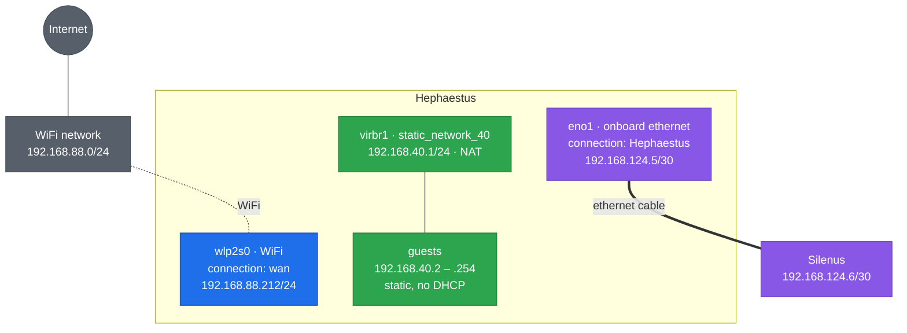

# Hephaestus — Debian 13 "trixie" headless KVM host

Hostname `Hephaestus`. Purely headless: base system and `openssh-server` only, no
desktop environment, administered over SSH. The other hosts are
[Dionysus.md](../Dionysus/Dionysus.md), the Ryzen 9 3900X KVM host, and
[Silenus.md](../Silenus/Silenus.md), the ThinkPad workstation.

Two network interfaces — onboard WiFi and onboard ethernet — and no GPU to hand
to a guest, which is the one step this build drops against Dionysus. Two disks,
sizes as `lsblk` reports them:

| Role | Device | Size |
|---|---|---|
| OS and Docker `data-root` | `nvme0n1` | 232.9 GiB |
| `lssd` — VM disks and Docker volumes | `sda` | 1.8 TiB |

No swap partition and no swapfile anywhere in this build.

Every step here can be run again without harm. Files are written whole rather
than appended to, package installs skip what is present, and group membership
is unchanged when it is already granted. The single exception is `visudo` in
Step 3, which is a manual edit and is noted there.

**When something needs changing, change it here and re-run the step — never
patch the machine by hand.** A `sed` against a file this document writes leaves
the machine and the document disagreeing, and nothing will tell you which is
right. Every block is written to be run again.

## Facts to confirm before starting

Two things this document could not read from the machine. Each is marked at the
step that uses it.

| # | Fact | Used by |
|---|------|---------|
| 1 | Motherboard, for the BIOS setup key and menu paths | Step 1 |
| 2 | Whether `sda` is an SSD or a spinning disk. It changes nothing here, since no over-provisioning is left on it either way, but it belongs in the record | Step 2 |

Everything else is settled. The CPU vendor is deliberately not on the list: the
steps that care read it from the machine rather than being told.



The guest subnet is `192.168.40.0/24` here, against `192.168.24.0/24` on Silenus
and `192.168.32.0/24` on Dionysus. All three differ on purpose: the hosts can
reach one another, so overlapping guest ranges would make a guest on one
indistinguishable from a guest on another.

## Part 1 — OS installation

### Step 1 — BIOS: Secure Boot and virtualization

The same settings as Dionysus, including the ones passthrough would need. Every
host in this estate leaves the BIOS in the same state, so a machine that later
gains a card needs no trip back into firmware.

| # | Step | How |
|---|------|-----|
| 1 | Enter BIOS | Power off fully, power on, tap the setup key at the vendor splash |
| 2 | Note BIOS version | Write it down before changing anything |
| 3 | Secure Boot | `OS Type` = **Windows UEFI mode**, or the vendor's equivalent |
| 4 | Enable virtualization | `SVM Mode` on AMD, `Intel VT-x` on Intel |
| 5 | Enable IOMMU | `IOMMU` = **Enabled** — `AMD-Vi` or `Intel VT-d` |
| 6 | Above 4G Decoding | **Enabled** |
| 7 | Resizable BAR | **Auto**, or **Enabled** |
| 8 | Save and exit | Save changes and reboot |
| 9 | Boot the installer | Open the boot menu, pick the USB device |

**Notes**

- **Fact 1.** The setup key and the exact wording of each line depend on the board — commonly **Del** or **F2**. This table names the settings, not the menu paths, until the board is recorded.
- Debian's bootloader is signed by Microsoft's 3rd party UEFI CA. The key set has to include it or the machine will not boot and shows `Invalid signature detected`. On ASUS boards the switch is `OS Type` = **Windows UEFI mode**; other vendors name it after the CA directly.
- **The IOMMU lines are set even though nothing here uses them.** They cost nothing when idle, and the alternative is a trip back into firmware — on a machine at another site — the day this host is given a card. What is absent is the *operating system* side of passthrough: no `amd_iommu=on` on the kernel command line, no `vfio-pci` binding, no driver blacklist, no `vfio` in the initramfs. Dionysus.md Step 9 is where that lives if it is ever wanted here.
- Turning the 3rd party CA on may switch `Secure Boot Mode` from `Standard` to `Custom`. That is expected. Custom only means the key set is no longer the factory default; Secure Boot still checks every signature.
- Never use `Reset to Setup Mode` or `Clear All Secure Boot Keys`. They cause the boot failure above and Debian does not need them.
- There is no swap anywhere in this build, so the hibernation caveat that applies to Silenus does not arise.

### Step 2 — Disk partitioning

Choose **Manual** partitioning. `partman` supports XFS natively, so the layout
is created at install time rather than rebuilt afterwards. The installer counts
in decimal, so `MB` means 1,000,000 bytes. Type the **Enter as** value. The
installer will then display the **Shows as** value.

**NVMe 250 GB (`nvme0n1`) — 232.9 GiB**

| # | Partition | Size | Enter as | Shows as | Format | Mount |
|---|-----------|------|----------|----------|--------|-------|
| 1 | EFI | 1 GiB | `1075 MB` | 1.1 GB | EFI System Partition | `/boot/efi` |
| 2 | Boot | 2 GiB | `2147 MB` | 2.1 GB | ext4 | `/boot` |
| 3 | Root | 32 GiB | `34360 MB` | 34.4 GB | ext4 | `/` |
| 4 | Data | 192 GiB | `206158 MB` | 206.2 GB | xfs | `/data-root` |

**SATA 2 TB (`sda`) — 1.8 TiB**

| # | Partition | Size | Enter as | Shows as | Format | Mount |
|---|-----------|------|----------|----------|--------|-------|
| 1 | lssd | whole disk | `max` | about 2.0 TB | xfs | `/data-root/lssd` |

**Hostname and network, during the install**

| Field | Value |
|---|---|
| Interface | the onboard WiFi, `wlp2s0` — the installer asks for the network and its key |
| Addressing | DHCP. The work network hands out addresses; `192.168.88.212` is what it has been giving this machine |
| Hostname | `hephaestus` |
| Domain | leave empty |

Package selection: base system and `openssh-server` only. Deselect the desktop
environment task; this host stays headless.

**Notes**

- The OS disk here is the NVMe and the bulk disk is the SATA drive, which is the reverse of Dionysus. The four sizes on `nvme0n1` are identical to Dionysus's `sda` because the two disks are the same size, so the same numbers apply unchanged.
- The four partitions on `nvme0n1` come to 227 GiB of the 232.9 the disk reports, leaving about 5.9 GiB unpartitioned as SSD over-provisioning — the drive uses it for wear levelling, which keeps write speed up as it fills.
- `sda` takes the whole disk with `max` and keeps no such margin, which is the one deliberate difference from how Dionysus treats its bulk disks. **Fact 2**: if it turns out to be an SSD that will run close to full, taking 4% off it is worth more than the capacity.
- There is one bulk disk here where Dionysus has two, so there is one pool rather than two. `sssd` does not exist on this host; anything Dionysus would put there goes on `lssd`.
- The installer counts in GB, `df -h` counts in GiB. The root partition is entered as `34360 MB`, shows as `34.4 GB`, and reports as `32G` once installed. Same partition.
- For any other size: type `GiB x 1073.741824` MB, rounded. The EFI partition is entered as `1075 MB` rather than the 1074 the formula gives; that is the number the other two hosts use for the same partition, and one megabyte over makes no difference.
- Installing over WiFi means the installer needs the network name and key. If it cannot see the adapter at all, the firmware is missing: use the Debian installer image that includes non-free firmware.
- Without a working network the installer cannot reach the mirror, and Steps 3 to 8 have nothing to install from.
- No swap partition. Omit it from the table entirely rather than adding one and disabling it later. The installer warns that no swap space is selected; continue.
- XFS project quota (`pquota`/`prjquota`) is the one thing `partman`'s mount-options list does not expose. It is added to `/etc/fstab` after first boot, in Step 3.

### Step 3 — After install: repositories, quota, checks

#### 1. Become root

Everything in this step is run as root.

```bash
su -
```

#### 2. Install vim and sudo

```bash
apt update
```

```bash
apt install -y vim sudo
```

`visudo`, used in the next sub-step, comes from the `sudo` package rather than
from vim. The installer only installs `sudo` when the root password is left
empty; setting one leaves the package out altogether, and `visudo` reports
`command not found`.

Make vim the default editor for `visudo` and friends:

```bash
update-alternatives --config editor
```

#### 3. Add your user to sudoers

```bash
visudo
```

Find this line:

```
root    ALL=(ALL:ALL) ALL
```

Add your own user underneath it, replacing `username` with your login name:

```
username    ALL=(ALL:ALL) ALL
```

Save and exit. `visudo` checks the syntax before writing and refuses to save a
broken file, which is why it is used instead of editing the file directly.

This is the one step that is not safe to repeat blindly: running it again adds
a second identical line. `sudo` tolerates the duplicate, but check whether your
user is already there before adding it.

```bash
sudo -l -U username
```

#### 4. Add contrib and non-free

The installer writes the classic file, not a `.sources` file:

```bash
vim /etc/apt/sources.list
```

Make the file read exactly this:

```
deb http://deb.debian.org/debian/ trixie main contrib non-free non-free-firmware
deb-src http://deb.debian.org/debian/ trixie main contrib non-free non-free-firmware

deb http://security.debian.org/debian-security trixie-security main contrib non-free non-free-firmware
deb-src http://security.debian.org/debian-security trixie-security main contrib non-free non-free-firmware

deb http://deb.debian.org/debian/ trixie-updates main contrib non-free non-free-firmware
deb-src http://deb.debian.org/debian/ trixie-updates main contrib non-free non-free-firmware
```

Only `contrib` and `non-free` are new. Keep the suite name — `trixie`,
`trixie-security`, `trixie-updates` — between the URL and the components. If
you drop it, `apt update` fails with a 404 on the Release file.

```bash
grep ^deb /etc/apt/sources.list
```

#### 5. Update the system

```bash
apt full-upgrade
```

#### 6. Install the tools used for checking

```bash
apt install -y mokutil dmidecode efibootmgr
```

#### 7. Confirm ftype on both XFS filesystems

A hard requirement for both `overlay2` and project quotas. `partman`'s defaults
are not guaranteed to match a manual `mkfs.xfs`, so check rather than assume:

```bash
xfs_info /data-root      | grep ftype
```

```bash
xfs_info /data-root/lssd | grep ftype
```

Expect `ftype=1` on both.

`xfs_info: cannot open /data-root/...: Is a directory` does not mean the path is
missing. It means that path is not an XFS mount, so `xfs_info` fell through to
treating the argument as a device file. The usual cause is the wrong filesystem
type being picked for that partition in the installer — the next sub-step names
it outright.

#### 8. Confirm what the installer mounted

```bash
findmnt -no SOURCE,TARGET,FSTYPE,OPTIONS /data-root /data-root/lssd
```

Both must read `xfs`. Anything else has to be reformatted before going on: the
project quota this build rests on is an XFS feature, and Docker's
`--storage-opt size=` rests on the quota.

#### 9. Add project quota to fstab

```bash
vim /etc/fstab
```

Append `,pquota` immediately after `defaults` in the options field of those two
XFS entries. Leave every other line alone.

#### 10. Edit GRUB: the boot console

```bash
vim /etc/default/grub
```

These five lines are the whole active configuration. Make the uncommented lines
in the file read exactly this, and leave every commented line below them alone:

```
GRUB_DEFAULT=0
GRUB_TIMEOUT=9
GRUB_DISTRIBUTOR=`( . /etc/os-release && echo ${NAME} )`
GRUB_CMDLINE_LINUX_DEFAULT="quiet loglevel=3 systemd.show_status=auto udev.log_level=3"
GRUB_CMDLINE_LINUX=""
```

```bash
update-grub
```

#### 11. Reboot

```bash
systemctl reboot
```

This reboot is what makes the quota live. XFS initializes project quota on an
actual mount and refuses to do it on a remount, and every filesystem is mounted
fresh here — so no unmount and remount sequence is needed.

Log back in and become root again before the checks:

```bash
sudo -i
```

#### 12. Check Secure Boot

```bash
mokutil --sb-state
```

Expect `SecureBoot enabled`.

#### 13. Check the machine booted through shim

```bash
efibootmgr -v | grep -i shim
```

#### 14. Check the disks

```bash
lsblk -o NAME,SIZE,TYPE,FSTYPE,MOUNTPOINTS
```

Expect `1023M`, `2G`, `32G` and `192G` on `nvme0n1`, and one XFS partition
filling `sda`.

```bash
swapon --show
```

Expect no output.

#### 15. Check the quota is active

```bash
xfs_quota -x -c 'state' /data-root
```

```bash
xfs_quota -x -c 'state' /data-root/lssd
```

Expect `Accounting: ON` and `Enforcement: ON` on both.

#### 16. Check the BIOS version

```bash
dmidecode -s bios-version
```

Compare with what you wrote down in Step 1.

**Notes**

- `GRUB_CMDLINE_LINUX_DEFAULT` carries only the boot-console settings here. Dionysus adds `amd_iommu=on iommu=pt vfio-pci.disable_idle_d3=1` for passthrough. The BIOS has the IOMMU on either way — Step 1 sets the same firmware state on every host — but the kernel is not told to use it, because nothing here does.
- `GRUB_CMDLINE_LINUX` is empty, as on Dionysus and unlike Silenus. Silenus needs `rootflags=uquota,pquota` because its root filesystem is XFS with quota and root is mounted before `/etc/fstab` is read. Here root is ext4 and the quota is on ordinary fstab mounts, so fstab is the right place.
- A partition created as the wrong type is worth catching here rather than by its symptoms later. `lost+found` in the root of a mount is a good tell: ext4 creates it, XFS never does. So is a gap between `Size` and `Avail` in `df` on an almost-empty filesystem — ext4 reserves 5% of its blocks for root, XFS reserves none.
- Reformatting one of these is cheap while they are empty: `umount`, `mkfs.xfs -f <device>`, then fix `/etc/fstab`. `mkfs.xfs` writes a **new UUID**, so the `UUID=` in fstab has to be replaced with `blkid -s UUID -o value <device>` — left stale, the next boot waits for a device that no longer exists. Set the type to `xfs` and the fsck pass to `0` in the same edit: XFS has no boot-time fsck, and a pass of `2` makes it fail on every boot.
- Use `state`, not `report -p`. With no projects assigned yet, `report -p` prints nothing whether quota is on or off, which hides exactly the failure this check exists to catch.
- The kernel renames the options: `pquota` shows as `prjquota` in `findmnt`.
- If a `umount` reports the target is busy, `fuser -m /data-root` names the process holding it.

The installation is done.

## Part 2 — Configuration

### Step 4 — Firmware updates

#### 1. Become root

```bash
sudo -i
```

#### 2. Install fwupd

```bash
apt install -y fwupd fwupd-amd64-signed
```

#### 3. Refresh, look, apply

```bash
fwupdmgr refresh --force
```

```bash
fwupdmgr get-devices
```

```bash
fwupdmgr get-updates
```

```bash
fwupdmgr update
```

#### 4. Reboot to apply

```bash
systemctl reboot
```

Log back in, become root, and confirm nothing is left:

```bash
fwupdmgr get-updates
```

The last line must read `No updates available`. If it does not, repeat from
`fwupdmgr update`.

```bash
mokutil --sb-state
```

Expect `SecureBoot enabled`.

**Notes**

- `fwupd-amd64-signed` holds the Debian-signed EFI file. Without it firmware updates stop working once Secure Boot is on, which it is on this host.
- Never power off during a firmware update. Firmware is written during the reboot, not by `fwupdmgr update`, so apply, reboot and re-check are one round.
- `Devices with no available firmware updates` and `Devices with the latest available firmware version` both mean nothing to do. Only the last line decides.
- What appears depends on the vendor. Lenovo publishes to LVFS, which is why Silenus updates its BIOS this way; many desktop and small-form-factor boards do not, and their firmware is updated from the BIOS's own flash utility instead. `fwupdmgr get-devices` is the honest answer for this machine, not a list written in advance.
- A BIOS update resets BIOS settings on many boards, virtualization included. After one, redo Step 1 and re-run the checks in Step 3.

### Step 5 — Packages

#### 1. Become root

```bash
sudo -i
```

#### 2. Install the packages

```bash
apt install -y bash-completion bridge-utils btop curl git iptables iputils-ping jq lshw make network-manager openssl pciutils progress pwgen python3 rsync sshuttle sudo tmux tree unrar vim wget
```

#### 3. Check the CPU exposes virtualization

```bash
grep -Ec '(vmx|svm)' /proc/cpuinfo
```

Expect a number above 0.

**Notes**

- This is Silenus's package list with everything desktop-only removed: no GNOME, no flatpak, no fonts, no media applications, none of which has anything to talk to on a headless host. It is identical to Dionysus's.
- Claude Code is not installed here, though Silenus has it. It is a developer tool for the machine you work at; a server has no use for it, and its repository and signing key are two more things to keep trusted for no return.
- `bash-completion`, `python3` and `openssl` are here because `install.sh` in Step 6 checks for them and warns if they are missing.
- `network-manager` is here because a headless Debian install does not have it. It arrives on a desktop machine as a dependency of `gnome-core`; no task a base install selects pulls it in. Step 9 needs `nmcli`, so it is installed with everything else rather than in the middle of reconfiguring the network.
- `iptables` makes libvirt's choice deterministic. `/etc/libvirt/network.conf` documents the default as the first available of `[iptables, nftables]`, and `libvirt-daemon-system` depends on neither, so the backend would otherwise be decided by whatever else happened to pull one in. Step 10 reads libvirt's `LIBVIRT_FWI` chain with `iptables`; under the nftables backend that chain does not exist.
- `pciutils` supplies `lspci`. There is no passthrough here, but it is what identifies the WiFi and ethernet controllers when firmware is missing.

### Step 6 — Bash, tmux, and SSH configuration

#### 1. Leave the root shell

Step 5 ended as root. Everything in this step runs as your own user, the clone
included — a repository cloned by root lands in `/root`, which is mode `0700`,
so your account could not even read it afterwards.

```bash
exit
```

#### 2. Get the repository onto this machine

```bash
git clone <repository-url> ~/dotfiles
```

```bash
cd ~/dotfiles/linux_terminal_dotfiles_configuration/Hephaestus
```

Keep it. `install.sh` needs the directory to re-run, and Step 7 reads
`kvm/static_network_40.xml` from it.

#### 3. Run the installer

```bash
./install.sh
```

#### 4. Reload the shell

```bash
exec bash
```

**Notes**

- `Hephaestus/install.sh` is byte-identical to `Dionysus/install.sh` apart from its header comment, and `bash/`, `tmux/`, `ssh/` and `hushlogin` are byte-identical copies. It carries no keyboard-lock service, no GNOME shortcuts and no GTK3 dark setting, because none of them has a session to act on here.
- It asks once whether to configure `root` as well. Answer `y`. The answer is recorded in `/etc/dotfiles-root-configured`, so every later run keeps `/root` in step.
- Safe to re-run. The SSH block is replaced between its markers, not duplicated, and your own `Host` entries outside the markers are untouched.
- It writes `/etc/ssh/banner.txt` and points sshd at it with `Banner`, so the notice is shown **before authentication** and to **every account**. That is the only place that works, because `~/.hushlogin` — which these dotfiles also install — suppresses the motd for any account that has one.
- `/etc/motd` is emptied and `/etc/update-motd.d/10-uname` has its execute bit dropped, which removes Debian's licence paragraphs and the kernel line.
- It writes `/etc/ssh/sshd_config.d/99-local.conf` so root can only reach SSH with a key, never a password. **On this host, open a second session and confirm it works before closing the first.** It is at another site and reached over WiFi; there is no console to fall back on.
- `.bashrc` adds `/usr/local/sbin`, `/usr/sbin` and `/sbin` to your PATH, so `sysctl`, `swapon` and `iptables` resolve for a non-root user.
- `Hephaestus/bash/bash_aliases` drops the `DE`, `EN` and `kbd` aliases. They call `gsettings` against the GNOME input-source schema, which does not exist on this host.

### Step 7 — KVM and libvirt

#### 1. Become root

```bash
sudo -i
```

#### 2. Install the packages

```bash
apt install -y qemu-system-x86 qemu-utils ovmf virtinst libosinfo-bin osinfo-db osinfo-db-tools libvirt-daemon-system libvirt-clients libguestfs-tools
```

#### 3. Start the daemon

```bash
systemctl enable --now libvirtd.socket
```

```bash
systemctl is-active libvirtd.socket
```

Expect `active`. `libvirtd.service` itself stays `inactive` until something
connects to the socket, which is normal and not a fault.

#### 4. Turn on nested virtualization

Required only for running a hypervisor inside a guest. The module is `kvm_intel`
or `kvm_amd` depending on the CPU, so read it from the machine rather than
choosing:

```bash
KVM_MOD=$(ls /sys/module | grep -E '^kvm_(intel|amd)$'); echo "$KVM_MOD"
```

```bash
cat /sys/module/$KVM_MOD/parameters/nested
```

`Y` on Intel or `1` on AMD means it is already on — skip the rest of this
sub-step. Otherwise:

```bash
echo "options $KVM_MOD nested=1" > /etc/modprobe.d/$KVM_MOD.conf
```

```bash
modprobe -r $KVM_MOD && modprobe $KVM_MOD
```

```bash
cat /sys/module/$KVM_MOD/parameters/nested
```

#### 5. Raise the open file limit

```bash
vim /etc/security/limits.d/99-kvm.conf
```

Put this in it:

```
*    soft    nofile    65536
*    hard    nofile    1048576
```

#### 6. Define the storage pool

One bulk disk here, so one pool:

```bash
virsh pool-define-as lssd-pool dir --target /data-root/lssd
```

```bash
virsh pool-build lssd-pool
```

```bash
virsh pool-start lssd-pool
```

```bash
virsh pool-autostart lssd-pool
```

```bash
virsh pool-list --all
```

Expect `lssd-pool` active with autostart `yes`.

#### 7. Remove the default NAT network

`libvirtd` creates a `default` NAT network on install, typically
`192.168.122.0/24`, with its own DHCP server. This host uses one network only,
so it is removed rather than left stopped:

```bash
virsh net-destroy default
```

```bash
virsh net-undefine default
```

#### 8. Define the one network this host uses

`sudo -i` in sub-step 1 left you in `/root`, so go back to the host directory
first — this path is relative to it:

```bash
cd ~<your-user>/dotfiles/linux_terminal_dotfiles_configuration/Hephaestus
```

```bash
virsh net-define kvm/static_network_40.xml
```

```bash
virsh net-start static_network_40
```

```bash
virsh net-autostart static_network_40
```

```bash
virsh net-list --all
```

Expect `static_network_40` active with `Autostart yes`, and no `default`.

```bash
ip -br addr show virbr1
```

Expect `192.168.40.1/24`.

#### 9. Leave the root shell, and join the groups

```bash
exit
```

```bash
sudo usermod -aG libvirt,kvm $USER
```

Log out and log back in, then check:

```bash
groups
```

**Notes**

- There is no `qemu-kvm` package in trixie. `qemu-system-x86` provides the emulator, and KVM itself is a kernel module already present. An install line naming `qemu-kvm` fails outright with no candidate.
- `virt-manager` is not installed. Drive this host from Silenus with `virt-manager -c qemu+ssh://hephaestus/system`, or use `virsh`.
- **Always name a pool when creating a guest.** libvirt keeps a `default` storage pool pointing at `/var/lib/libvirt/images`, on the 32 GiB root filesystem, and `virt-install` uses it silently when `--disk` names no pool. It is not removed here because `virt-manager` recreates it on connect; `--disk vol=lssd-pool/<name>.qcow2` is the habit that avoids it.
- The `usermod` sub-step has to run as your own user. Under `sudo` as root, `$USER` is `root`, so the groups would go to the wrong account.
- Run as an ordinary user, `virsh` defaults to `qemu:///session`, a per-user hypervisor with no networks and no machines. The system VMs are on `qemu:///system`. Set `LIBVIRT_DEFAULT_URI=qemu:///system` if you would rather not type it.
- `modprobe -r` fails if a virtual machine is running. Shut them down first.
- The packaged `osinfo-db` is the maintained source, refreshed by `apt upgrade`. Do not use `osinfo-db-import --latest`: it fetches from a third-party host libosinfo's own maintainers have flagged as unreliable.
- `net-define` reads the file at define time and stores a copy of its own, so editing the repository file later means running `net-define` again.

### Step 8 — Docker

Docker Engine from Docker's own repository, not Debian's `docker.io`.

#### 1. Become root, and add the repository

```bash
sudo -i
```

```bash
apt install -y ca-certificates curl gnupg
```

```bash
install -m 0755 -d /etc/apt/keyrings
```

```bash
curl -fsSL https://download.docker.com/linux/debian/gpg -o /etc/apt/keyrings/docker.asc
```

```bash
chmod a+r /etc/apt/keyrings/docker.asc
```

```bash
vim /etc/apt/sources.list.d/docker.sources
```

Put this in it:

```
Types: deb
URIs: https://download.docker.com/linux/debian
Suites: trixie
Components: stable
Architectures: amd64
Signed-By: /etc/apt/keyrings/docker.asc
```

```bash
apt update
```

#### 2. Install the engine

```bash
apt install -y docker-ce docker-ce-cli containerd.io docker-buildx-plugin docker-compose-plugin
```

#### 3. Point data-root at the data partition

```bash
mkdir -p /etc/docker
```

```bash
vim /etc/docker/daemon.json
```

Put this in it:

```
{
  "data-root": "/data-root",
  "storage-driver": "overlay2",
  "features": {
    "containerd-snapshotter": false
  }
}
```

```bash
systemctl enable --now docker && systemctl restart docker
```

#### 4. Check the driver and backing filesystem

```bash
docker info --format '{{.Driver}}'
```

Expect `overlay2`. If it says `overlayfs`, the quota will not be enforced.

```bash
docker info --format '{{.DriverStatus}}'
```

Expect `Backing Filesystem` to read `xfs` and `Supports d_type` to read `true`.

#### 5. Prove the quota is enforced

Reporting the right size is not proof. Fill the container past its limit and
watch it stop:

```bash
docker run --rm --storage-opt size=1G busybox sh -c 'df -h / | tail -1; dd if=/dev/zero of=/big bs=1M count=1200'
```

Expect `dd` to stop early with `No space left on device`.

#### 6. Leave the root shell, and join the group

```bash
exit
```

```bash
sudo usermod -aG docker $USER
```

Log out and back in, then:

```bash
docker run --rm hello-world
```

**Notes**

- Two storage tiers by design. **Capped**, on `/data-root`: image layers and small containers, bounded per container with `--storage-opt size=`. **Uncapped**, bind-mounted: anything needing real bulk mounts explicitly into `/data-root/lssd` and is not subject to the cap.
- Docker defaults to the containerd snapshotter, which reports itself as `overlayfs` and does not implement `--storage-opt size=`. It accepts the flag and ignores it, so a container silently gets the whole disk. Turning the snapshotter off is what makes the XFS project quota from Step 3 apply.
- Debian's `docker.io` and `podman-docker` conflict with Docker Engine. Remove either before installing.
- Membership in the `docker` group is equivalent to root. Treat it as an admin privilege, not a convenience.
- `Suites: trixie` is written out rather than derived from `/etc/os-release`, so the file says which release it is pinned to.

### Step 9 — Networking

Two interfaces. Guests are on neither: they live on the libvirt network defined
in Step 7, and libvirt owns that bridge.

| Interface | Kind | Address | Purpose |
|---|---|---|---|
| `wlp2s0` | onboard WiFi | `192.168.88.212/24` | `wan` — the way out |
| `eno1` | onboard ethernet | `192.168.124.5/30` | point-to-point to Silenus |

Persisted through NetworkManager's own connection profiles with `nmcli`, not
`/etc/network/interfaces`.

#### 1. Become root

```bash
sudo -i
```

#### 2. Confirm NetworkManager is running

```bash
systemctl enable --now NetworkManager
```

```bash
systemctl is-active NetworkManager
```

#### 3. Confirm the interface names

```bash
ip -br link
```

Both `wlp2s0` and `eno1` are fixed by their hardware paths and need no renaming.
Dionysus renames its second interface only because a USB adapter arrives as
`enx` followed by its MAC address; both of these are onboard.

#### 4. Configure WiFi as the way out

The installer already joined this network, so a profile exists. Give it the name
the other hosts use for the same job:

```bash
nmcli connection show
```

```bash
nmcli con mod <existing-wifi-profile> connection.id wan
```

The work network runs DHCP, so the addressing needs nothing further:

```bash
nmcli con up wan
```

```bash
ip -br addr show wlp2s0
```

Expect an address on `192.168.88.0/24`. It has been `192.168.88.212`; a DHCP
lease is not a guarantee, so anything that has to reach this host by address
either wants a reservation on the work DHCP server or should use the cable.

#### 5. The point-to-point link to Silenus

`eno1` carries a cable to Silenus, on its own `/30`. No gateway and no DNS, so
it cannot compete with WiFi for the default route:

```bash
nmcli con add type ethernet ifname eno1 con-name Hephaestus ipv4.method manual ipv4.addresses 192.168.124.5/30 ipv4.never-default yes ipv6.method disabled
```

```bash
nmcli con mod Hephaestus connection.autoconnect yes
```

```bash
nmcli con up Hephaestus
```

```bash
ip -br addr show eno1
```

Expect `192.168.124.5/30`.

Silenus takes `192.168.124.6/30` at the other end — Silenus.md Step 13. With
both up:

```bash
ping -c4 192.168.124.6
```

Whatever the installed system had on this interface before — a bridge named
`br`, holding `192.168.48.2/30` — is replaced. Delete the old profiles first if
they are still listed:

```bash
nmcli connection show
```

```bash
nmcli connection delete bridge-br bridge-br-slave
```

#### 6. Confirm

```bash
nmcli device status
```

```bash
ip -br addr show | grep -E 'wlp2s0|eno1'
```

```bash
ip -4 route
```

Exactly one default route, on `wlp2s0`.

#### 7. Enable IP forwarding

```bash
vim /etc/sysctl.d/99-kvm.conf
```

Put this in it:

```
net.ipv4.ip_forward = 1
```

```bash
sysctl --system
```

```bash
sysctl net.ipv4.ip_forward
```

Expect `net.ipv4.ip_forward = 1`.

**Notes**

- There is no bridge built by hand for guests. Defining the guest network in libvirt — the same choice the other two hosts made — means libvirt creates and owns `virbr1`.
- Nothing is renamed on this host. Both interfaces have stable hardware-derived names already, which is exactly why Dionysus renames its USB adapter and this machine renames nothing.
- Whether `wlp2s0` needs the `[ifupdown] managed=false` handover Dionysus's ethernet needed depends on what the installer wrote. Check `/etc/network/interfaces`: if it carries a stanza for `wlp2s0`, remove all but the loopback lines and restart NetworkManager, exactly as Dionysus.md Step 10 sub-step 5 does. A WiFi install usually leaves NetworkManager in charge already.
- The two point-to-point links do not overlap. Silenus reaches Dionysus on `192.168.124.0/30` — hosts `.1` and `.2` — and this machine on `192.168.124.4/30` — hosts `.5` and `.6`. Adjacent `/30`s out of the same `/29`, deliberately, so one range covers every point-to-point link in the estate without any two colliding.
- `wan` takes its address by DHCP, which is the one place this host differs from the other two — both of those are static because their router hands out nothing. A lease can change, so the cable at `192.168.124.5` is the address to rely on, and Silenus reaches the guest network across it first for exactly that reason.
- The cable is the second way in when WiFi fails, which matters more here than on Dionysus: this machine is at another site and has no console you can walk to. Bring `Hephaestus` up before touching `wan`, and make any change to `wan` from a `tmux` session so a dropped connection does not leave a command half-done.
- Silenus has one spare ethernet port and two point-to-point links to make with it, so it carries a profile per peer on the same interface and only one is up at a time. Which one depends on which cable is plugged in, and it is chosen by hand there.

### Step 10 — Firewall

`libvirt` writes the rules for `static_network_40` itself when the network
starts. This step adds the one thing libvirt deliberately does not do: letting a
machine outside the guest network open a connection into it.

#### 1. Read what libvirt installed

```bash
sudo iptables -L LIBVIRT_FWI -n -v
```

The last rule is `-o virbr1 -j REJECT`. A guest reaches the outside and the
replies come back through conntrack; a connection *started* from outside matches
neither `ACCEPT` and falls to that `REJECT`. That is the gap this step closes.

#### 2. What this step adds, and what is optional

| # | Rule | Required | Why |
|---|------|----------|-----|
| 1 | `FORWARD` accept, private ranges → `192.168.40.0/24` | **yes** | without it nothing on your network can reach a guest at all |
| 2 | `DNAT` on a port to one guest | no | only to publish a guest service |

#### 3. Add the required rules, as a service

The rules have to sit **above** the jump to `LIBVIRT_FWI`. Position cannot be
saved and restored: `libvirtd` inserts its jumps at the head of `FORWARD` every
time it starts, so a saved ruleset comes back permanently below the `REJECT`.

```bash
sudo tee /usr/local/sbin/guest-net-access >/dev/null <<'EOF'
#!/bin/sh
# Let private networks open connections into the libvirt guest network.
#
# These must precede the jump to LIBVIRT_FWI, whose final rule rejects anything
# inbound to virbr1 that conntrack does not already know. libvirtd re-inserts
# its own jumps at the head of FORWARD on every start, so this deletes and
# re-inserts rather than assuming a position it once had.
set -e
for net in 192.168.0.0/16 172.16.0.0/12 10.0.0.0/8; do
    iptables -D FORWARD -s "$net" -d 192.168.40.0/24 -o virbr1 -j ACCEPT 2>/dev/null || true
done
for net in 10.0.0.0/8 172.16.0.0/12 192.168.0.0/16; do
    iptables -I FORWARD 1 -s "$net" -d 192.168.40.0/24 -o virbr1 -j ACCEPT
done
EOF
sudo chmod +x /usr/local/sbin/guest-net-access
sudo tee /etc/systemd/system/guest-net-access.service >/dev/null <<'EOF'
[Unit]
Description=Allow private networks into the libvirt guest network
After=libvirtd.service docker.service
Wants=libvirtd.service
PartOf=libvirtd.service

[Service]
Type=oneshot
RemainAfterExit=yes
ExecStart=/usr/local/sbin/guest-net-access

[Install]
WantedBy=multi-user.target
EOF
sudo systemctl daemon-reload
sudo systemctl enable --now guest-net-access.service
```

#### 4. Test the rules, and their position

```bash
sudo iptables -S FORWARD
```

```bash
ours=$(sudo iptables -S FORWARD | grep -n 'd 192.168.40.0/24 -o virbr1 -j ACCEPT' | tail -1 | cut -d: -f1); libv=$(sudo iptables -S FORWARD | grep -n -- '-j LIBVIRT_FWI' | cut -d: -f1); if [ -n "$ours" ] && [ -n "$libv" ] && [ "$ours" -lt "$libv" ]; then echo "  PASS  rules precede LIBVIRT_FWI ($ours < $libv)"; else echo "  FAIL  ours=$ours libvirt=$libv"; fi
```

**Existence is not enough, and that is the whole point of this test.**
`iptables -C` finds a rule wherever it sits and reports success, including from
below the `REJECT` that stops the packet. Only the position tells you whether
the rule does anything.

**This tests the rules, not reachability.** Pinging a guest address proves
nothing while no guest holds that address. Reachability is tested in Step 11.

#### 5. Optional — publish a guest service

```bash
sudo apt install -y iptables-persistent
```

```bash
sudo iptables -t nat -A PREROUTING -i wlp2s0 -p tcp --dport 2222 -j DNAT --to-destination 192.168.40.10:22
```

```bash
sudo iptables -A FORWARD -i wlp2s0 -o virbr1 -p tcp -d 192.168.40.10 --dport 22 -j ACCEPT
```

```bash
sudo netfilter-persistent save
```

**Notes**

- `PartOf=libvirtd.service` is what makes a `libvirtd` restart carry this unit with it. Without it the rules stay where they were while libvirt re-inserts its jumps on top, and the host silently stops accepting connections into the guest network until the next boot.
- `-I FORWARD 1` inserts at the head. Appended with `-A`, the rules end up after `LIBVIRT_FWI` has already rejected the packet, and every existence check still passes.
- A route is still needed at the other end. These rules permit the traffic; they do not tell any machine how to get here.
- `172.16.0.0/12` includes `172.17.0.0/16`, which is `docker0`, so containers can reach guests too. Drop that range if you would rather they could not.
- `iptables-persistent` is installed only for the optional rule. The required rules do not use it, and installing it regardless means a saved snapshot of libvirt's and Docker's chains being restored at boot next to the copies those daemons rebuild.

### Step 11 — Reboot and final verification

Nested virtualization's module option and the guest network's autostart need
this boot to take hold together. The quota from Step 3 is already live.

#### 1. Reboot

```bash
systemctl reboot
```

#### 2. Boot fundamentals

```bash
swapon --show
```

Expect no output.

#### 3. Both interfaces and the guest bridge

```bash
ip -br addr show | grep -E 'wlp2s0|eno1|virbr1'
```

```bash
ip -4 route
```

Exactly one default route, on `wlp2s0`.

#### 4. The guest network came back

```bash
virsh -c qemu:///system net-list --all
```

Expect `static_network_40` active with `Autostart yes`, and no `default`.

#### 5. The firewall order survived

```bash
systemctl is-active guest-net-access.service
```

```bash
ours=$(sudo iptables -S FORWARD | grep -n 'd 192.168.40.0/24 -o virbr1 -j ACCEPT' | tail -1 | cut -d: -f1); libv=$(sudo iptables -S FORWARD | grep -n -- '-j LIBVIRT_FWI' | cut -d: -f1); if [ -n "$ours" ] && [ -n "$libv" ] && [ "$ours" -lt "$libv" ]; then echo "  PASS  $ours < $libv"; else echo "  FAIL  ours=$ours libvirt=$libv"; fi
```

This boot is the only thing that proves the ordering holds. `libvirtd` inserts
its jumps at the head of `FORWARD` when it starts, and `guest-net-access` runs
after it to put the rules back in front.

#### 6. Nested virtualization and quota persisted

```bash
KVM_MOD=$(ls /sys/module | grep -E '^kvm_(intel|amd)$'); cat /sys/module/$KVM_MOD/parameters/nested
```

```bash
xfs_quota -x -c 'state' /data-root
```

```bash
xfs_quota -x -c 'state' /data-root/lssd
```

Expect `Accounting: ON` and `Enforcement: ON` on both.

#### 7. Functional tests

A guest on the pool:

```bash
virsh vol-create-as lssd-pool <vm-name>.qcow2 20G --format qcow2
```

```bash
virt-install --name <vm-name> --memory 4096 --vcpus 2 --disk vol=lssd-pool/<vm-name>.qcow2 --network network=static_network_40 --os-variant debian13 --cdrom /data-root/isos/debian-13-netinst.iso --noautoconsole
```

Docker quota enforcement:

```bash
docker run --rm --storage-opt size=5G alpine df -h /
```

Reachability, outward from inside a guest:

```bash
ping -c3 192.168.88.212
```

Then inward, from a machine with a route to `192.168.40.0/24`:

```bash
ping -c3 <guest-address>
```

The guest needs a static address on `192.168.40.0/24` with gateway
`192.168.40.1` — nothing hands one out.

**Notes**

- Verification is gathered here because the changes in Steps 9 and 10 only take effect on this boot. Checking them earlier reports the state before the change, which reads as a pass and is not one.
- `virt-install` with `--cdrom` expects a console, which a headless host does not have. `--noautoconsole` is in the line above for that reason; connect afterwards with `virsh console <vm-name>`.
- The inward reachability test is the first point in the build where it can honestly be run, because until now no guest held an address.
- **Reaching a guest from off-site is an SSH hop, not a route.** Silenus routes `192.168.40.0/24` across the cable when it is here, and across the work LAN when it is on that WiFi. From anywhere else — over the office VPN, from home — the way in is `ssh hephaestus` and then `ssh <guest-address>`, or `ssh -J hephaestus <guest-address>` in one line. No route over the VPN is configured on either side, deliberately: it would need a change on the office router for a path this already covers.

### Step 12 — Check the whole setup

`check.sh` in this host's directory runs every check the steps above describe
and prints `PASS` or `FAIL` for each one.

#### 1. Run it

```bash
cd ~/dotfiles/linux_terminal_dotfiles_configuration/Hephaestus
```

```bash
./check.sh
```

#### 2. Read the totals

The last line gives the counts, and any failure is listed again at the end with
what the machine returned and what was wanted.

**Notes**

- Run it as your own user over SSH. It refuses to start as root, because the dotfiles, group membership and `~/.ssh/config` all live in your account.
- It asks for your sudo password once. Some checks read files only root can see, and one reads libvirt's firewall chains.
- It needs network. It pulls the `busybox` and `hello-world` images to prove the Docker storage quota is really enforced.
- It only reads. Nothing on the machine is changed, so it is safe to run at any time.
- Every step from 1 to 10 has at least one assertion here, under a heading naming it. Steps 11 and 12 have none by design: Step 11 is itself a verification pass, and Step 12 is this script.
- The `eno1` checks assert the profile and its address, not that the link is up. The cable is only connected when Silenus is on site, and a check that failed whenever it was unplugged would be noise rather than signal.
