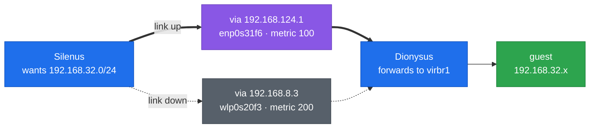

# Silenus — ThinkPad T14 Gen 4 (Intel), Debian 13 "trixie"

Hostname `Silenus`. Lenovo ThinkPad T14 Gen 4, Intel platform: a GNOME
workstation, with KVM and Docker running alongside the desktop session. The
headless host is [Dionysus.md](../Dionysus/Dionysus.md).

Every step here can be run again without harm. Files are written whole rather
than appended to, package installs skip what is present, and group membership
is unchanged when it is already granted. The single exception is `visudo` in
Step 3, which is a manual edit and is noted there.

## Part 1 — OS installation

### Step 1 — BIOS: allow the Microsoft 3rd party CA

| # | Step | How |
|---|------|-----|
| 1 | Enter BIOS | Power off fully, power on, tap **F1** at the Lenovo splash |
| 2 | Note BIOS version | `Main` tab — write it down |
| 3 | Open Secure Boot | `Security → Secure Boot` |
| 4 | Allow the 3rd party CA | `Allow Microsoft 3rd Party UEFI CA` = **On** |
| 5 | Check the other lines | `Secure Boot` = **On**, `Secure Boot Mode` = **Custom Mode** |
| 6 | Save and exit | **F10** → **Yes** |
| 7 | Boot the installer | **F12** at the splash, pick the USB device |

**Notes**

- Debian's bootloader is signed by Microsoft's 3rd party UEFI CA. With this **Off** the machine will not boot and shows `Invalid signature detected`.
- Turning the 3rd party CA on switches `Secure Boot Mode` from `Standard Mode` to `Custom Mode`. That is expected. Custom Mode only means the key set is no longer the factory default. Secure Boot still checks every signature.
- Leave `Secure Boot` **On** for the whole install.
- Never use `Reset to Setup Mode` or `Clear All Secure Boot Keys`. They cause the failure above and Debian does not need them.

### Step 2 — Disk partitioning

Choose **Manual** partitioning. The installer counts in decimal, so `MB` means
1,000,000 bytes. Type the **Enter as** value. The installer will then display
the **Shows as** value.

| # | Partition | Size | Enter as | Shows as | Format | Mount |
|---|-----------|------|----------|----------|--------|-------|
| 1 | EFI | 1 GiB | `1075 MB` | 1.1 GB | EFI System Partition | `/boot/efi` |
| 2 | Boot | 2 GiB | `2147 MB` | 2.1 GB | ext4 | `/boot` |
| 3 | Root | 888 GiB | `953483 MB` | 953.5 GB | xfs | `/` |

**Notes**

- Leave the rest of the disk unpartitioned. That free space is SSD over-provisioning: the disk reports `953.9G`, minus 3 GiB for EFI and boot, minus 888 GiB for root, leaves about 63 GiB. The drive uses it for wear levelling, which keeps write speed up as the disk fills.
- The installer counts in GB, `df -h` counts in GiB. Root shows as `953.5 GB` here and `888G` later. Same partition.
- For any other size: type `GiB x 1073.741824` MB, rounded.
- Sizes on the installed system: `lsblk` reports `1G`, `2G`, `888G`. `df -h` reports the EFI partition as `1022M`, because the FAT filesystem uses a little of it. Both are correct.
- No swap partition. Only hibernation needs one, and hibernation does not work while Secure Boot is on.
- The installer warns that no swap space is selected. Continue.

### Step 3 — After install: repositories, quota, checks

#### 1. Become root

Everything in this step is run as root.

```bash
su -
```

#### 2. Install vim and sudo

```bash
apt update
```

```bash
apt install -y vim sudo
```

`visudo`, used in the next sub-step, comes from the `sudo` package rather than
from vim. The installer only installs `sudo` when the root password is left
empty; setting one leaves the package out altogether, and `visudo` reports
`command not found`.

Make vim the default editor for `visudo` and friends:

```bash
update-alternatives --config editor
```

#### 3. Add your user to sudoers

The installer only grants `sudo` when the root password is left empty. If you
set a root password, the user has none — and, as the previous sub-step notes,
the package is not installed either.

```bash
visudo
```

Find this line:

```
root    ALL=(ALL:ALL) ALL
```

Add your own user underneath it, replacing `username` with your login name:

```
username    ALL=(ALL:ALL) ALL
```

Save and exit. `visudo` checks the syntax before writing and refuses to save a
broken file, which is why it is used instead of editing the file directly.

This is the one step that is not safe to repeat blindly: running it again adds
a second identical line. `sudo` tolerates the duplicate, but check whether your
user is already there before adding it.

Check it:

```bash
sudo -l -U username
```

#### 4. Add contrib and non-free

The installer writes the classic file, not a `.sources` file:

```bash
vim /etc/apt/sources.list
```

Make the file read exactly this:

```
deb http://deb.debian.org/debian/ trixie main contrib non-free non-free-firmware
deb-src http://deb.debian.org/debian/ trixie main contrib non-free non-free-firmware

deb http://security.debian.org/debian-security trixie-security main contrib non-free non-free-firmware
deb-src http://security.debian.org/debian-security trixie-security main contrib non-free non-free-firmware

deb http://deb.debian.org/debian/ trixie-updates main contrib non-free non-free-firmware
deb-src http://deb.debian.org/debian/ trixie-updates main contrib non-free non-free-firmware
```

Only `contrib` and `non-free` are new. Keep the suite name — `trixie`,
`trixie-security`, `trixie-updates` — between the URL and the components. If
you drop it, `apt update` fails with a 404 on the Release file.

Check the result:

```bash
grep ^deb /etc/apt/sources.list
```

#### 5. Update the system

```bash
apt update
```

```bash
apt full-upgrade
```

#### 6. Install the tools used for checking

```bash
apt install -y mokutil dmidecode efibootmgr
```

#### 7. Edit GRUB: quota and boot timeout

Docker can only cap a container's disk size (`--storage-opt size=`) when root
is mounted with project quota. Root is mounted before `/etc/fstab` is read, so
this goes on the kernel command line.

```bash
vim /etc/default/grub
```

These five lines are the whole active configuration. Make the uncommented lines
in the file read exactly this, and leave every commented line below them alone:

```
GRUB_DEFAULT=0
GRUB_TIMEOUT=9
GRUB_DISTRIBUTOR=`( . /etc/os-release && echo ${NAME} )`
GRUB_CMDLINE_LINUX_DEFAULT="quiet loglevel=3 systemd.show_status=auto udev.log_level=3"
GRUB_CMDLINE_LINUX="rootflags=uquota,pquota"
```

The whole set is written out rather than a list of lines to change, so a missing
line is obvious. `GRUB_DEFAULT` and `GRUB_DISTRIBUTOR` come from the installer
and are left as they are. `GRUB_TIMEOUT` is `5` by default, and both
`GRUB_CMDLINE_LINUX_DEFAULT` and `GRUB_CMDLINE_LINUX` are what this step sets.

Compare the file against all five before saving. Deleting
`GRUB_CMDLINE_LINUX_DEFAULT` rather than editing it is an easy mistake, and the
result is a machine that prints every kernel and service message across the
screen while it boots.

Apply it:

```bash
update-grub
```

**Notes on the boot messages**

- `quiet` is what stops the kernel printing to the screen. Debian ships it by default, so a loud boot usually means the line was removed rather than never set.
- `loglevel=3` keeps errors and warnings visible while dropping the rest, so a real failure still reaches you.
- `systemd.show_status=auto` hides the per-service status lines but brings them back when a unit fails.
- The two `GRUB_CMDLINE_LINUX` settings are different. `_DEFAULT` applies to the normal entry only, so recovery mode stays verbose, which is what you want from it. The plain one applies to every entry, which is why the quota flags go there.
- A line such as `EFI stub: Loaded initrd from LINUX_EFI_INITRD_MEDIA_GUID device path` is printed by the EFI stub before the kernel console exists, so `quiet` cannot suppress it. One or two lines between GRUB and the login screen are normal on UEFI.
- Edit `/etc/default/grub`, never `/boot/grub/grub.cfg`. The second is generated by `update-grub` and any edit to it is lost.

#### 8. Reboot

```bash
systemctl reboot
```

Log back in and become root again before the checks:

```bash
sudo -i
```

#### 9. Check Secure Boot

```bash
mokutil --sb-state
```

Expect `SecureBoot enabled`.

```bash
dmesg | grep -i "secure boot"
```

Expect `secureboot: Secure boot enabled`.

#### 10. Check the machine booted through shim

```bash
efibootmgr -v | grep -i shim
```

Expect `\EFI\debian\shimx64.efi`.

#### 11. Check the disk

```bash
lsblk
```

Expect `1G`, `2G`, and `888G`.

```bash
findmnt -no FSTYPE /
```

Expect `xfs`.

#### 12. Check the quota

```bash
findmnt -no OPTIONS /
```

Expect `usrquota` and `prjquota` in the list.

```bash
xfs_quota -x -c state /
```

Expect `Project quota state` with `Accounting: ON` and `Enforcement: ON`.

#### 13. Check the BIOS version

```bash
dmidecode -s bios-version
```

Compare with what you wrote down in Step 1.

**Notes**

- If the Secure Boot check says `SecureBoot disabled`, the `Secure Boot` toggle is Off in the BIOS. Turn it back on.
- Hibernation does not work while Secure Boot is on. The kernel refuses to write the resume image because it cannot verify the swap on resume. Suspend works normally.
- The quota cannot go in `/etc/fstab`. XFS cannot enable quota at remount, and root is already mounted by then.
- `rootflags` goes in `GRUB_CMDLINE_LINUX`, not `GRUB_CMDLINE_LINUX_DEFAULT`, so it applies to the recovery entries too.
- The kernel renames the options. `pquota` shows as `prjquota` and `uquota` as `usrquota`.

The installation is done.

## Part 2 — Configuration

### Step 4 — Runtime libraries and Qt applications

Prebuilt applications that ship their own Qt still link against a few system
libraries, and Qt applications need help to match the GNOME theme.

#### 1. Install the missing libraries

```bash
apt install -y libpcre2-16-0 libdouble-conversion3
```

#### 2. Install the GNOME theme and the Wayland plugin

```bash
apt install -y qt6-wayland qgnomeplatform-qt6 qtwayland5 qgnomeplatform-qt5
```

#### 3. Set the Qt environment variables

```bash
vim /etc/environment
```

Add these two lines:

```
QT_QPA_PLATFORM=wayland;xcb
QT_QPA_PLATFORMTHEME=gnome
```

#### 4. Log out and log back in

#### 5. Check the session type

```bash
echo $XDG_SESSION_TYPE
```

Expect `wayland`.

#### 6. Check the variables took effect

```bash
env | grep QT_QPA
```

Expect both lines.

#### 7. Check a prebuilt binary for anything still missing

```bash
LD_LIBRARY_PATH=/path/to/app/usr/lib ldd /path/to/app/binary | grep "not found"
```

No output means nothing is missing.

**Notes**

- Both Qt 5 and Qt 6 are covered. `qgnomeplatform-qt5` and `qgnomeplatform-qt6` supply the GNOME theme, `qtwayland5` and `qt6-wayland` supply the Wayland platform plugin.
- `/etc/environment` is not a shell script. Write `KEY=value`, with no `export` and no quotes.
- `wayland;xcb` tries Wayland and falls back to X11. Plain `wayland` breaks any application whose bundled Qt has no Wayland plugin.
- Set `LD_LIBRARY_PATH` to the application's own library directory first, or `ldd` reports its bundled libraries as missing too.
- An application that exits printing nothing is usually a missing library or a missing graphical session, not a broken application.
- Eclipse applications such as DBeaver are built on SWT and follow neither these Qt settings nor the GNOME dark preference. Set the theme inside the application: `Window → Preferences → User Interface → Appearance → Theme → Dark`, then restart it.

### Step 5 — Firmware updates

Lenovo publishes firmware to LVFS, so the BIOS, embedded controller, and
Thunderbolt can all be updated from Linux. No Windows and no USB needed.

#### 1. Become root

Step 4 ended with a log out, so this starts again as an ordinary user.

```bash
sudo -i
```

#### 2. Install fwupd

```bash
apt install -y fwupd fwupd-amd64-signed
```

#### 3. Refresh the firmware list

```bash
fwupdmgr refresh --force
```

#### 4. See what the machine has

```bash
fwupdmgr get-devices
```

#### 5. See what is available

```bash
fwupdmgr get-updates
```

#### 6. Apply

```bash
fwupdmgr update
```

#### 7. Reboot to apply

```bash
systemctl reboot
```

Log back in and become root again before continuing:

```bash
sudo -i
```

#### 8. Check nothing is left

```bash
fwupdmgr get-updates
```

The last line must read `No updates available`. If it does not, repeat from
the Apply sub-step.

#### 9. Check the new BIOS version

```bash
dmidecode -s bios-version
```

#### 10. Check Secure Boot survived

```bash
mokutil --sb-state
```

Expect `SecureBoot enabled`.

**Notes**

- Plug the charger in first. On battery every device reports `Device requires AC power to be connected` and is skipped without failing, so the update looks like it worked when nothing happened.
- Never power off during a firmware update.
- Firmware is written during the reboot, not by `fwupdmgr update`. Apply, reboot and re-check are one round. Repeat until the check is clean.
- `Devices with no available firmware updates` and `Devices with the latest available firmware version` both mean nothing to do. Only the last line decides.
- `fwupd-amd64-signed` holds the Debian-signed EFI file. Without it firmware updates stop working once Secure Boot is on.
- A BIOS update can reset BIOS settings. If the Secure Boot check says `SecureBoot disabled`, redo Step 1.

### Step 6 — Packages

#### 1. Become root

The rest of this step is run as root.

```bash
sudo -i
```

#### 2. Install the packages

```bash
apt install -y bash-completion bridge-utils btop curl default-jre duf ethtool ffmpeg filezilla foliate fonts-jetbrains-mono git gnome-firmware gnome-shell-extension-manager gnome-shell-extensions gnome-tweaks htop ipcalc iperf3 jq keepassxc lshw make nano ncdu net-tools network-manager-openvpn-gnome nmap obs-studio openssh-server openssl openvpn3-client progress pwgen python3 python3.13-venv rsync sshuttle sudo tmux traceroute tree unrar vim virt-top vlc wget xclip yt-dlp
```

#### 3. Install flatpak

```bash
apt install -y flatpak gnome-software-plugin-flatpak
```

#### 4. Add the flathub remote

```bash
flatpak remote-add --if-not-exists flathub https://dl.flathub.org/repo/flathub.flatpakrepo
```

Check it actually took. This command downloads a file, so it fails if the
network is down, and the next sub-step is meaningless without it:

```bash
flatpak remotes
```

`flathub` must be listed. If it is not, run the `remote-add` again and read the
error.

#### 5. Install the flatpak applications

```bash
flatpak install -y flathub org.telegram.desktop com.belmoussaoui.Obfuscate md.obsidian.Obsidian io.gitlab.adhami3310.Impression
```

#### 6. Install what the Claude Code repository needs

```bash
apt install -y curl gnupg
```

#### 7. Create the keyring directory

```bash
install -m 0755 -d /etc/apt/keyrings
```

#### 8. Fetch the Claude Code signing key

```bash
curl -fsSL https://downloads.claude.ai/keys/claude-code.asc -o /etc/apt/keyrings/claude-code.asc
```

```bash
chmod a+r /etc/apt/keyrings/claude-code.asc
```

Read the key before trusting it:

```bash
gpg --show-keys /etc/apt/keyrings/claude-code.asc
```

#### 9. Add the repository

```bash
vim /etc/apt/sources.list.d/claude-code.sources
```

Put this in it:

```
Types: deb
URIs: https://downloads.claude.ai/claude-code/apt/stable
Suites: stable
Components: main
Signed-By: /etc/apt/keyrings/claude-code.asc
```

```bash
apt update
```

#### 10. Install Claude Code

```bash
apt install -y claude-code
```

#### 11. Check it

```bash
apt policy claude-code
```

The `Installed:` line must show a version, not `(none)`.

**Notes**

- Log out and back in before flatpak applications appear in GNOME Software.
- The four flatpaks are Telegram, Obfuscate for redacting screenshots, Obsidian for notes, and Impression for writing bootable USB images.
- `flatpak install` takes several application IDs at once, and `-y` stops it asking to confirm each one. Installed as root, they are available to every user.
- `No remote refs found` from `flatpak install` means the remote is missing, not that the application is. Check `flatpak remotes` first.
- A remote added with `--user` is invisible to a `flatpak install` run as root, and the reverse. `flatpak remotes` shows which installation each belongs to.
- The terminal uses JetBrains Mono at size 14. `fonts-jetbrains-mono` is in the package list above, so it is already installed. Select it under `Terminal → Preferences → Profile → Text → Custom font`.
- Font size changes the terminal cell height. A window whose height is not an exact multiple of that leaves a thin unpainted strip under the last row, so the size is worth tuning.
- `gnome-firmware` is the graphical front end for the `fwupd` work in Step 5. It shows the same devices and updates as `fwupdmgr`.
- `default-jre` runs `.jar` files with `java -jar`. It pulls OpenJDK 21. The headless variant is not used because a jar that opens a window fails at runtime under it rather than at install time.
- `net-tools` provides `netstat`, `ifconfig` and `route`. They are superseded by `ss` and `ip` from `iproute2`, which is already installed, but the old names are still what most documentation uses.
- `virt-top` reads from libvirt. Until libvirt is installed and running it shows nothing.
- Claude Code comes from Anthropic's own repository, not Debian's. The key is fetched separately and `Signed-By` limits it to that one repository.
- `gpg --show-keys` prints the key before apt is told to trust it. Compare the fingerprint with the one Anthropic publishes.
- Run `claude` as your own user, not root. Its settings and login live in your home directory, so as root they land in `/root`.
- The keyring directory and the key fetch are done again in Step 9 for Docker. Both are safe to repeat: the directory is left alone if it exists, and the key file is overwritten with the same content.

### Step 7 — Bash, tmux, and SSH configuration

The bash, tmux, and SSH configuration is in this repository, which you already
have. Everything it needs was installed in Step 6.

#### 1. Leave the root shell

```bash
exit
```

#### 2. Run the installer

```bash
./install.sh
```

#### 3. Reload the shell

```bash
exec bash
```

**Notes**

- Run it from the repository directory as your own user. As root it configures `/root` and leaves your account untouched.
- It asks whether to configure `root` as well. Answer `y` for the same prompt, aliases, and tmux settings under `su`.
- Safe to re-run. The SSH block is replaced, not duplicated.
- Keep the repository. The installer needs it to re-run.
- `.bashrc` adds `/usr/local/sbin`, `/usr/sbin` and `/sbin` to your PATH. Debian leaves these out for non-root users, so `sysctl`, `swapon` and `efibootmgr` report `command not found` even though `sudo` runs them. This makes your PATH cover the same directories as root's.
- Check it with `command -v sysctl`. It must print `/usr/sbin/sysctl`. If it prints nothing, the shell has not been reloaded yet.
- It also installs `lock-keyboard-en.service`, a systemd user service that switches the keyboard to English the moment the screen locks, whatever was in use — German included — so the unlock prompt is never stuck on a layout that cannot type your password. The previous layout is recorded under `$XDG_RUNTIME_DIR` and restored on unlock, so a deliberate `DE` survives the lock rather than being discarded by it. The English pair comes back with English selected, not Persian: it is restored by way of English-only, since rewriting the list is what resets the selection.
- `keyboard-en-tick.timer` is the other half, every 10 minutes, and it manages the English pair only: German is left alone, English stays English, Persian is switched back to English. It cannot distinguish the last two — both are the same `sources` list and GNOME's `current` index reads 0 either way — so it drops Persian and restores it, which forces English in both cases.
- Check it with `systemctl --user status lock-keyboard-en.service`. It must be `active (running)`.
- It also writes `/etc/ssh/sshd_config.d/99-local.conf` so root can only reach SSH with a key, never a password. Ordinary users and port 22 are unchanged. This needs sudo, so answer `y` at the root prompt.
- It also sets the GNOME shortcuts: `Ctrl+Alt+T` for the terminal, `Super+E` for Files, `Super+I` for Settings, and `Alt+Tab` to switch windows rather than applications.
- A command typed with a leading space is not written to the history file. Use it for anything carrying a password or a token. One space is enough.
- History is written at every prompt, not only when the shell exits. A tmux pane that is killed rather than closed keeps everything typed in it.
- It also writes `/etc/profile.d/99-history.sh` so both rules apply to every account, not only yours. That file is read by login shells, so an account without these dotfiles gets the rules on a tty or over SSH.
- It also writes `/etc/ssh/banner.txt` and points sshd at it with `Banner`, so it is shown **before authentication** and to **every account**. That is the right place for a notice telling someone they are not welcome — after login it is addressed to a person who is already in — and it is the only place that works here, because `~/.hushlogin` suppresses the motd for any account that has one. The file carries a name and a short notice and no hostname or kernel version, so it is correct unchanged on every host.
- `/etc/motd` is emptied and `/etc/update-motd.d/10-uname` has its execute bit dropped, which removes Debian's licence paragraphs and the kernel line for any account without a `.hushlogin` — root, in practice. The file is not deleted, so a package upgrade can restore it and the next `install.sh` run turns it off again. `Last login` is left alone: it is worth seeing.
- It also writes `~/.config/gtk-3.0/settings.ini` with `gtk-application-prefer-dark-theme=1`. GNOME's dark preference is a libadwaita setting, so a GTK3 application that never opted into it stays light. This is narrower than exporting `GTK_THEME`, which would force every GTK application onto the legacy Adwaita-dark including the GTK4 ones that already follow GNOME correctly.
- `install.sh` owns that file. If you put your own keys in it, they are replaced the next time the dark setting is missing from it.
- `README.md` covers the prompt, the tmux keys, and what changes.

### Step 8 — KVM and libvirt

#### 1. Become root

The rest of this step is run as root.

```bash
sudo -i
```

#### 2. Check the CPU exposes virtualization

```bash
grep -Ec '(vmx|svm)' /proc/cpuinfo
```

Expect a number above 0. This machine is Intel, so the flag is `vmx`.

#### 3. Install the packages

```bash
apt install -y qemu-system-x86 qemu-utils ovmf virtinst virt-manager libvirt-daemon-system libvirt-clients libosinfo-bin osinfo-db osinfo-db-tools libguestfs-tools
```

#### 4. Start the daemon

```bash
systemctl enable --now libvirtd.socket
```

```bash
systemctl is-active libvirtd.socket
```

Expect `active`. `libvirtd.service` itself stays `inactive` until something
connects to the socket, which is normal and not a fault.

#### 5. Turn on nested virtualization

```bash
cat /sys/module/kvm_intel/parameters/nested
```

If it prints `Y` or `1`, skip the rest of this sub-step. Otherwise:

```bash
echo 'options kvm_intel nested=1' > /etc/modprobe.d/kvm-intel.conf
```

```bash
modprobe -r kvm_intel
```

```bash
modprobe kvm_intel
```

```bash
cat /sys/module/kvm_intel/parameters/nested
```

Expect `Y`.

#### 6. Enable IP forwarding

```bash
vim /etc/sysctl.d/99-kvm.conf
```

Put this in it:

```
net.ipv4.ip_forward = 1
```

```bash
sysctl --system
```

```bash
sysctl net.ipv4.ip_forward
```

Expect `net.ipv4.ip_forward = 1`.

#### 7. Raise the open file limit

```bash
vim /etc/security/limits.d/99-kvm.conf
```

Put this in it:

```
*    soft    nofile    65536
*    hard    nofile    1048576
```

#### 8. Leave the root shell

```bash
exit
```

#### 9. Add your user to the libvirt and kvm groups

```bash
sudo usermod -aG libvirt,kvm $USER
```

Log out and log back in, then check:

```bash
groups
```

Expect `libvirt` and `kvm` in the list.

#### 10. Remove the default network

`libvirtd` defines a `default` NAT network on `192.168.122.0/24`, with its own
DHCP server, when the package is installed. This host uses one network only, so
`default` is removed rather than left stopped.

```bash
virsh -c qemu:///system net-destroy default
```

```bash
virsh -c qemu:///system net-undefine default
```

#### 11. Define the one network this host uses

`static_network_24` — NAT on `192.168.24.0/24`, no DHCP, guests configured
statically. The definition is `kvm/static_network_24.xml` in this repository,
and its comment block carries the address plan.

```bash
virsh -c qemu:///system net-define kvm/static_network_24.xml
```

```bash
virsh -c qemu:///system net-start static_network_24
```

```bash
virsh -c qemu:///system net-autostart static_network_24
```

#### 12. Verify as your own user

```bash
virsh -c qemu:///system list --all
```

```bash
virsh -c qemu:///system net-list --all
```

Both must run without a permission error. `static_network_24` must show
`active` with `Autostart yes`, and `default` must not be listed at all.

```bash
ip -br addr show virbr1
```

Expect `192.168.24.1/24`. `virbr0` belonged to `default` and should be gone.

**Notes**

- There is no `qemu-kvm` package in trixie. `qemu-system-x86` is the one that provides the emulator, and KVM itself is a kernel module that is already present.
- The `usermod` sub-step has to run as your own user, not root. Under `sudo` as root, `$USER` is `root`, so the groups would be added to the wrong account.
- `virt-manager` is a GTK3 application and ignores the GNOME dark preference on its own. Step 7 writes the GTK3 setting that fixes it. Nothing needs editing in its `.desktop` file.
- The connection URI matters. Run as an ordinary user, `virsh` defaults to `qemu:///session`, a per-user hypervisor with no networks and no machines. The system VMs are on `qemu:///system`. Set `LIBVIRT_DEFAULT_URI=qemu:///system` if you would rather not type it each time.
- Group membership only applies at the next login. `newgrp libvirt` works for one shell if you do not want to log out.
- `modprobe -r kvm_intel` fails if a virtual machine is running. Shut them down first.
- Nested virtualization is only needed to run a hypervisor inside a guest. Ordinary guests do not use it.
- `osinfo-db` comes from the Debian archive and is refreshed by `apt upgrade`. Do not use `osinfo-db-import --latest`; it fetches from a third-party host.
- `/etc/security/limits.d` applies to login sessions, not to systemd services. If libvirtd itself needs a higher limit, add a `LimitNOFILE` drop-in under `/etc/systemd/system/libvirtd.service.d/`.
- libvirt raises `net.ipv4.ip_forward` itself for its NAT network, but setting it here makes it explicit and survives for bridged or routed setups.
- Run `net-define` from the repository directory, or give the file an absolute path. libvirt reads the file at define time and stores a copy of its own, so the repository file is not consulted again afterwards; editing it later means running `net-define` again.
- Guests get no address by themselves. With no `<dhcp>` section there is nothing handing them one, so each guest is configured by hand: address in `192.168.24.2`–`192.168.24.254`, netmask `255.255.255.0`, gateway `192.168.24.1`, DNS of your choosing. A guest left on DHCP simply comes up with no address.
- Sub-step 10 is the one part of this step that errors on a second run: `net-destroy` reports the network is not active and `net-undefine` that it does not exist. Both are harmless and mean the work is already done. `net-define` is safe to repeat — it replaces the stored definition — and `net-start` errors the same harmless way once the network is running.
- The bridge is `virbr1`, not `virbr0`. `virbr0` was `default`'s and disappears with it. Nothing else on this host claims `virbr1`, and the name is fixed in the XML rather than left to libvirt so it stays predictable across rebuilds.
- NAT means guests reach the outside and the outside cannot reach them. Exposing a guest service needs an explicit port forward on the host.

### Step 9 — Docker

Docker Engine from Docker's own repository, not Debian's `docker.io`.

#### 1. Become root

The rest of this step is run as root.

```bash
sudo -i
```

#### 2. Install what the repository setup needs

```bash
apt install -y ca-certificates curl
```

#### 3. Create the keyring directory

```bash
install -m 0755 -d /etc/apt/keyrings
```

#### 4. Fetch Docker's signing key

```bash
curl -fsSL https://download.docker.com/linux/debian/gpg -o /etc/apt/keyrings/docker.asc
```

```bash
chmod a+r /etc/apt/keyrings/docker.asc
```

#### 5. Add the repository

```bash
vim /etc/apt/sources.list.d/docker.sources
```

Put this in it:

```
Types: deb
URIs: https://download.docker.com/linux/debian
Suites: trixie
Components: stable
Architectures: amd64
Signed-By: /etc/apt/keyrings/docker.asc
```

```bash
apt update
```

#### 6. Install the engine

```bash
apt install -y docker-ce docker-ce-cli containerd.io docker-buildx-plugin docker-compose-plugin
```

#### 7. Start it

```bash
systemctl enable --now docker
```

```bash
systemctl is-active docker
```

Expect `active`.

#### 8. Switch to the overlay2 storage driver

Docker now defaults to the containerd snapshotter, which reports itself as
`overlayfs` and does not implement `--storage-opt size=`. It accepts the flag
and ignores it, so a container silently gets the whole disk. The classic
`overlay2` driver is the one that honours the XFS project quota from Step 3.

```bash
vim /etc/docker/daemon.json
```

Put this in it:

```
{
  "features": {
    "containerd-snapshotter": false
  }
}
```

```bash
systemctl restart docker
```

```bash
docker info --format '{{.Driver}}'
```

Expect `overlay2`. If it still says `overlayfs`, the quota will not be
enforced.

```bash
docker info --format '{{.DriverStatus}}'
```

Expect `Backing Filesystem` to read `xfs` and `Supports d_type` to read `true`.

#### 9. Prove the quota is enforced

Reporting the right size is not proof. Fill the container past its limit and
watch it stop:

```bash
docker run --rm --storage-opt size=1G busybox sh -c 'df -h / | tail -1; dd if=/dev/zero of=/big bs=1M count=1200'
```

Expect `df` to report about `1.0G`, and `dd` to stop early with
`No space left on device`. If `dd` writes all 1200 MiB, the limit is not
active.

#### 10. Leave the root shell

```bash
exit
```

#### 11. Add your user to the docker group

```bash
sudo usermod -aG docker $USER
```

Log out and log back in, then check it works without `sudo`:

```bash
docker run --rm hello-world
```

**Notes**

- Debian's `docker.io` and `podman-docker` conflict with Docker Engine. If either was installed earlier, remove it before installing the engine.
- Adding your user to the `docker` group must run as your own user, not root. Under `sudo` as root, `$USER` is `root`, and the group would go to the wrong account.
- Membership in the `docker` group is equivalent to root. Any member can start a container that mounts the whole filesystem. Treat it as an admin privilege, not a convenience.
- `Suites: trixie` is written out rather than derived from `/etc/os-release`, so the file says which release it is pinned to. Change it when the machine is upgraded.
- `--storage-opt size=` works only on `overlay2` over XFS with project quota. It is not supported on ext4, and not by the containerd snapshotter.
- Switching the driver hides images pulled under the previous one. They are not deleted, but they live in a separate store. Pull them again if anything is missing.
- `--rm` deletes the container when it exits, so these checks leave nothing behind.

### Step 10 — Laptop lid

Closing the lid locks the session and turns the display off. The machine keeps
running, so anything in progress carries on.

#### 1. Become root

```bash
sudo -i
```

#### 2. Create the override

```bash
mkdir -p /etc/systemd/logind.conf.d
```

```bash
vim /etc/systemd/logind.conf.d/99-lid.conf
```

Put this in it:

```
[Login]
HandleLidSwitch=lock
HandleLidSwitchExternalPower=lock
HandleLidSwitchDocked=ignore
```

#### 3. Reboot

```bash
systemctl reboot
```

#### 4. Check the setting took

```bash
systemd-analyze cat-config systemd/logind.conf | grep -i handlelidswitch
```

The first two must read `lock`, the third `ignore`.

This command reads the files on disk, not what the running daemon loaded, so it
shows the new value whether or not the reboot has happened. To see what logind
is actually doing, close the lid and read the journal:

```bash
journalctl -b -u systemd-logind --since '2 min ago' --no-pager | tail -5
```

`Lid closed.` with no action after it means the daemon is still running the
previous configuration.

#### 5. Check the behaviour

Close the lid, wait a minute, open it again. It must ask for the password, and:

```bash
uptime
```

The uptime must have kept counting, with no resume in between.

**Notes**

- A drop-in under `/etc/systemd/logind.conf.d/` is used rather than editing `/etc/systemd/logind.conf`, so a package upgrade cannot overwrite it.
- `lock` screen-locks every session without suspending, which is the difference from `suspend` and from `ignore`. `ignore` does nothing at all: no lock, no display off.
- The three settings cover the three cases logind separates: on battery, on external power, and docked. Setting only the first leaves the machine suspending whenever it is plugged in.
- Docked stays `ignore`, which is also the systemd default. With external displays attached, closing the lid should not lock the machine.
- Reboot rather than `systemctl restart systemd-logind`. Restarting it can end the graphical session.
- Every change here needs another reboot. Editing the file changes nothing until logind reloads it.
- GNOME delegates the lid to logind, so this is what decides the behaviour. GNOME's own blank and lock timeouts still apply and are set in Settings.

### Step 11 — Visual Studio Code extensions

A suggested set, not a requirement. Visual Studio Code is not in the Debian
archive and is not installed by this guide, so `code` must already be on the
machine.

#### 1. Check the CLI is available

```bash
code --version
```

#### 2. Install the extensions

```bash
code --install-extension anthropic.claude-code --install-extension inferrinizzard.prettier-sql-vscode --install-extension mechatroner.rainbow-csv --install-extension mongodb.mongodb-vscode --install-extension ms-azuretools.vscode-containers --install-extension ms-azuretools.vscode-docker --install-extension ms-kubernetes-tools.vscode-kubernetes-tools --install-extension ms-python.autopep8 --install-extension ms-python.debugpy --install-extension ms-python.flake8 --install-extension ms-python.pylint --install-extension ms-python.python --install-extension ms-python.vscode-pylance --install-extension ms-python.vscode-python-envs --install-extension ms-toolsai.datawrangler --install-extension ms-toolsai.jupyter --install-extension ms-toolsai.jupyter-keymap --install-extension ms-toolsai.jupyter-renderers --install-extension ms-toolsai.vscode-jupyter-cell-tags --install-extension ms-toolsai.vscode-jupyter-slideshow --install-extension ms-vscode-remote.remote-containers --install-extension ms-vscode-remote.remote-ssh --install-extension ms-vscode-remote.remote-ssh-edit --install-extension ms-vscode.makefile-tools --install-extension ms-vscode.remote-explorer --install-extension openai.chatgpt --install-extension redhat.vscode-xml --install-extension redhat.vscode-yaml
```

#### 3. Check what is installed

```bash
code --list-extensions
```

**Notes**

- Run this as your own user. Extensions install into `~/.vscode/extensions`, so as root they land in `/root` and your account does not get them.
- `--install-extension` may be repeated, so all of them go in one command. Extensions already present are left alone, which makes this safe to re-run.
- To capture the set from a machine you have already configured: `code --list-extensions | sed 's/^/code --install-extension /'`.
- Pin versions with `code --list-extensions --show-versions` if the list needs to be reproducible rather than current.

### Step 12 — Sort the application grid into folders

The grid behind **Super+A** can be grouped into folders. This sorts every
installed application into a folder named for its first letter. Run it as your
own user, not root: the layout is a per-user setting.

#### 1. See what it will do

```bash
./gnome-app-folders.py --list
```

Nothing is changed. Each application is listed under the folder it would go
into.

#### 2. Apply it

```bash
./gnome-app-folders.py --apply
```

It prints each folder and its count as it goes, then resets
`org.gnome.shell app-picker-layout`. The dock is left alone.

To empty the pinned dock at the same time:

```bash
./gnome-app-folders.py --clear-dock
```

#### 3. Read back what was written

```bash
./gnome-app-folders.py --status
```

This reads the settings, not the source files, so it shows what GNOME will
actually use.

#### 4. Log out and log back in

GNOME Shell reads the folder layout when the session starts. Under Wayland the
shell cannot be restarted on its own, so a full log out is needed.

#### 5. Check

Press **Super+A**. The grid shows folders `A` to `Z`, plus `0-9` and `Other` if
anything falls outside the alphabet.

**Notes**

- GNOME Shell keeps its own arrangement of the grid in `org.gnome.shell app-picker-layout`. While that exists it overrides the folder layout, so folders appear to do nothing even after a log out. The script resets it, which is what makes the change take.
- Re-run it after installing anything. It clears the folders it manages and rebuilds them from the applications present at that moment, so a new entry lands in the right folder and nothing else moves.
- Applications are read from every directory the desktop uses, including flatpak exports, so flatpaks are sorted alongside everything else.
- Entries marked `NoDisplay` or `Hidden` are skipped, which is why the count is smaller than the number of `.desktop` files on disk.
- Sorting is by the displayed name, not the file name. `org.gnome.Nautilus.desktop` is called Files, so it lands under `F`.
- `--clear-dock` also unpins everything from the dock. It is off by default, so a normal run never changes the dock.
- Nothing is changed without `--apply` or `--clear-dock`. Run it with no arguments to see the options.
- `--status` reads the settings back. If it disagrees with `--list`, the write failed rather than the sort being wrong.
- To undo it completely: `gsettings reset org.gnome.desktop.app-folders folder-children` followed by `gsettings reset org.gnome.shell app-picker-layout`.

### Step 13 — Point-to-point link to Dionysus

A cable between this laptop and Dionysus, carrying traffic between the two
machines and nothing else. It runs from an external USB NIC at Dionysus's end
into this laptop's onboard RJ45, so the two ends sit on different hardware. Dionysus takes `192.168.124.1/30`; this end takes `192.168.124.2/30`.
Plug the cable in before starting: the profile binds to an interface name, and
sub-step 1 reads which.

```mermaid
graph TB
    INET(("Internet"))
    R["Router &middot; home<br/>192.168.8.1<br/>no DHCP"]
    AP["WiFi &middot; work<br/>192.168.88.0/24"]
    INET --- R
    INET --- AP

    subgraph SIL ["Silenus &middot; ThinkPad T14 Gen 4"]
        SW["wlp0s20f3 &middot; WiFi<br/>connection: Huawei-Router<br/>192.168.8.2/24"]
        SP["enp0s31f6 &middot; onboard RJ45<br/>Dionysus 192.168.124.2/30<br/>Hephaestus 192.168.124.6/30"]
        SB["virbr1 &middot; static_network_24<br/>192.168.24.1/24 &middot; NAT"]
        SG["guests 192.168.24.2 &ndash; .254"]
        SB --- SG
    end

    subgraph DIO ["Dionysus &middot; Ryzen 9 3900X &middot; home"]
        DW["enp4s0 &middot; onboard Intel I211<br/>connection: wan<br/>192.168.8.3/24"]
        DP["p2plink0 &middot; external USB NIC<br/>192.168.124.1/30"]
        DB["virbr1 &middot; static_network_32<br/>192.168.32.1/24 &middot; NAT"]
        DG["guests 192.168.32.2 &ndash; .254"]
        DB --- DG
    end

    subgraph HEP ["Hephaestus &middot; work"]
        HW["wlp2s0 &middot; WiFi<br/>connection: wan<br/>192.168.88.212/24"]
        HE["eno1 &middot; onboard ethernet<br/>192.168.124.5/30"]
        HB["virbr1 &middot; static_network_40<br/>192.168.40.1/24 &middot; NAT"]
        HG["guests 192.168.40.2 &ndash; .254"]
        HB --- HG
    end

    R -.-|WiFi| SW
    R ---|ethernet| DW
    AP -.-|WiFi| HW
    SP ===|cable at home| DP
    SP -.-|cable at work| HE

    classDef wan fill:#1f6feb,stroke:#0b4fc0,color:#ffffff
    classDef p2p fill:#8957e5,stroke:#6a3fbf,color:#ffffff
    classDef guest fill:#2da44e,stroke:#1a7f37,color:#ffffff
    classDef infra fill:#57606a,stroke:#424a53,color:#ffffff
    class SW,DW,HW wan
    class SP,DP,HE p2p
    class SB,SG,DB,DG,HB,HG guest
    class R,AP,INET infra
```



Blue is each host's way out, purple the point-to-point links, green the guest
networks each host NATs behind itself. Dotted lines are wireless or a cable that
is only connected at one site; solid ones are permanent cable.

Silenus has one spare ethernet port and two peers, so it carries a profile for
each and only one is up at a time — `Dionysus` autoconnects at home,
`Hephaestus` is brought up by hand on arrival at work.

Three guest subnets, three point-to-point `/30`s out of one `/29`, and no two
overlap: the hosts can reach one another, so an address has to say which machine
it belongs to.



Both routes are permanent. NetworkManager withdraws a connection's routes when
it goes down, so unplugging the cable removes the metric-100 route and the
metric-200 one takes over with no manual step.

#### 1. Confirm which interface the cable is in

```bash
ip -br link
```

```bash
cat /sys/class/net/enp0s31f6/carrier
```

`enp0s31f6` is this laptop's onboard RJ45. `carrier: 1` means the cable is
plugged in. Nothing is renamed at this end: `enp0s31f6` is a PCI-slot name, so
it is already stable and already says what it is. Dionysus renames its end only
because an external USB NIC arrives as `enx` followed by its MAC address, which
is stable but unreadable.

#### 2. Create the profile

```bash
nmcli con add type ethernet ifname enp0s31f6 con-name Dionysus ipv4.method manual ipv4.addresses 192.168.124.2/30 ipv4.never-default yes ipv6.method disabled
```

```bash
nmcli con mod Dionysus connection.autoconnect yes
```

```bash
nmcli con up Dionysus
```

#### 3. Route to Dionysus's guests, preferring this link

Dionysus's guests live on `192.168.32.0/24`, behind Dionysus. There are two ways
to reach them: across this cable, or across the LAN. Both routes are installed,
and the metric decides which is used — lower wins.

On this link, metric 100:

```bash
nmcli con mod Dionysus +ipv4.routes "192.168.32.0/24 192.168.124.1 100"
```

On the wireless connection, metric 200. Replace `Huawei-Router` with your own
connection name from `nmcli connection show`:

```bash
nmcli con mod Huawei-Router +ipv4.routes "192.168.32.0/24 192.168.8.3 200"
```

```bash
nmcli con up Dionysus
```

```bash
nmcli con up Huawei-Router
```

#### 4. The second link, to Hephaestus

The same port carries a cable to Hephaestus when this laptop is at that site, on
its own `/30`. One interface, two profiles, one of them up at a time:

```bash
nmcli con add type ethernet ifname enp0s31f6 con-name Hephaestus ipv4.method manual ipv4.addresses 192.168.124.6/30 ipv4.never-default yes ipv6.method disabled
```

```bash
nmcli con mod Hephaestus connection.autoconnect no
```

```bash
nmcli con mod Hephaestus +ipv4.routes "192.168.40.0/24 192.168.124.5 100"
```

`Dionysus` keeps `autoconnect yes` and comes up on its own at home. `Hephaestus`
is brought up by hand on arrival, which takes the port from `Dionysus`:

```bash
nmcli con up Hephaestus
```

```bash
ip -br addr show enp0s31f6
```

Expect `192.168.124.6/30`.

```bash
ping -c4 192.168.124.5
```

Back home, `nmcli con up Dionysus` takes it back.

#### 5. Check it

```bash
ip -br addr show enp0s31f6
```

Expect `192.168.124.2/30`.

```bash
ip -4 route get 192.168.32.10
```

With the cable plugged in, expect `via 192.168.124.1 dev enp0s31f6`. Unplug it
and run the same command: the answer must become `via 192.168.8.3`, on the
wireless interface.

```bash
ip -4 route
```

Expect the default route still on the wireless interface, not on this link.

```bash
ping -c4 192.168.124.1
```

Needs Dionysus up on the other end.

**Notes**

- The two ends sit on different hardware. Dionysus reaches the cable through an external USB NIC, renamed to `p2plink0`, because its only onboard port is already the way out; this laptop has an onboard RJ45 going spare and uses it as it comes, `enp0s31f6`. Only the connection name is shared — `Dionysus` at both ends — so the link reads the same from either side. Connection names are local to a host, so nothing collides.
- A profile bound to an interface that does not exist fails with `No suitable device found for this connection ... mismatching interface name`, naming whichever ethernet device it did find. `nmcli con mod <name> connection.interface-name <iface>` repoints it without recreating it.
- Nothing is renamed at this end, so none of the naming hazards apply here. On Dionysus, where the external USB NIC does get renamed, `p2plink0` is chosen to be a name nothing else generates: the kernel produces `en*`, `wl*` and `ww*`, and `wpa_supplicant` produces `p2p0` and `p2p-dev-*` for Wi-Fi Direct.
- No gateway and no DNS on this profile. `ipv4.never-default yes` states the same thing a second way, so a later edit that adds a gateway by accident cannot take the default route away from the interface that actually reaches the internet.
- A `/30` gives four addresses: `.0` the network, `.1` and `.2` the two hosts, `.3` the broadcast. Both ends must carry the same prefix length, or each considers the other off-link and nothing passes. `.1` and `.2` cannot be written as a `/31` pair, because `/31` boundaries are even-aligned — `.0`–`.1`, then `.2`–`.3`.
- This is a second route to Dionysus when its LAN side is broken, which is worth having before reconfiguring that machine's management interface.
- Two point-to-point links share this one port, because the laptop has only one spare ethernet socket and is never at both sites at once. Neither can autoconnect blindly: with a `/30` there is no way to tell from carrier alone which peer is on the far end, so `Dionysus` autoconnects for the common case and `Hephaestus` is a deliberate `nmcli con up` on arrival. Activating either releases the port from the other.
- The two subnets are adjacent `/30`s out of the same `/29`: `192.168.124.0/30` for Dionysus, hosts `.1` and `.2`, and `192.168.124.4/30` for Hephaestus, hosts `.5` and `.6`. One range covers every point-to-point link in the estate with no two colliding.
- Hephaestus's guests get a route the same way Dionysus's do, `192.168.40.0/24` via `192.168.124.5`, but no LAN fallback: that machine is at another site and unreachable from here when the cable is out.
- Both routes are permanent, and NetworkManager withdraws a connection's routes when that connection goes down. Unplugging the cable therefore removes the metric-100 route on its own and the metric-200 one takes over, with no manual step. Plugging it back restores the preference.
- The metrics are what express "prefer the cable". Same destination, two next hops, lower metric wins. `ip -4 route get 192.168.32.10` is the way to ask the kernel which it would actually use, rather than reading the table and inferring.
- **The route alone does not make guests reachable.** A libvirt NAT network permits outbound traffic and `RELATED,ESTABLISHED` return traffic; a connection opened from outside into `192.168.32.0/24` is not in either category and is dropped on Dionysus. Dionysus.md Step 11 carries the forwarding rule that allows it. Test with `ping` to a guest, not by reading the routing table.
- The fallback path leans on Dionysus forwarding between `enp4s0` and `virbr1`, which is what `net.ipv4.ip_forward` in Dionysus.md Step 10 enables.
- Unplugging the cable takes the profile down with it. `autoconnect yes` brings it back when it is plugged in again; nothing needs re-running.

### Step 14 — Check the whole setup

`check.sh` in this repository runs every check the steps above describe and
prints `PASS` or `FAIL` for each one.

#### 1. Run it

```bash
./check.sh
```

#### 2. Read the totals

The last line gives the counts. Any failure names what it found and what it
expected, so it points at the step to redo.

**Notes**

- Run it as your own user from a desktop session terminal. It refuses to start as root or on a plain tty, because the dotfiles, GNOME settings, user services and group membership all live in your account and need the session bus.
- It asks for your sudo password once. Some checks read files only root can see.
- It needs network. It pulls the `busybox` and `hello-world` images to prove the Docker storage quota is really enforced.
- It only reads. Nothing on the machine is changed, so it is safe to run at any time.
- It exits `0` when everything passes and `1` otherwise.
- `nested conf` reports `not needed` when the kernel already has nested virtualisation on. That is a pass, not a gap.
- The Claude Code key check is pinned to the fingerprint published for the release key. If Anthropic rotates it, this fails on purpose and the new key needs checking by hand.
- **Step 11 is the one step this does not check.** Visual Studio Code is not in the Debian archive and this guide does not install it, so the extension list is a suggestion rather than part of the build. `code --list-extensions` is the check, if you want one. Every other step in this document has at least one assertion here.
